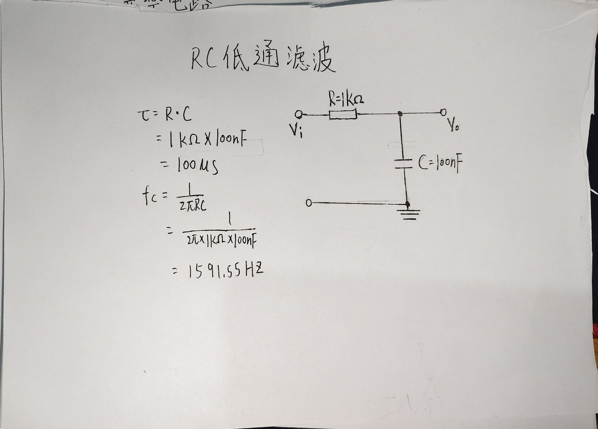
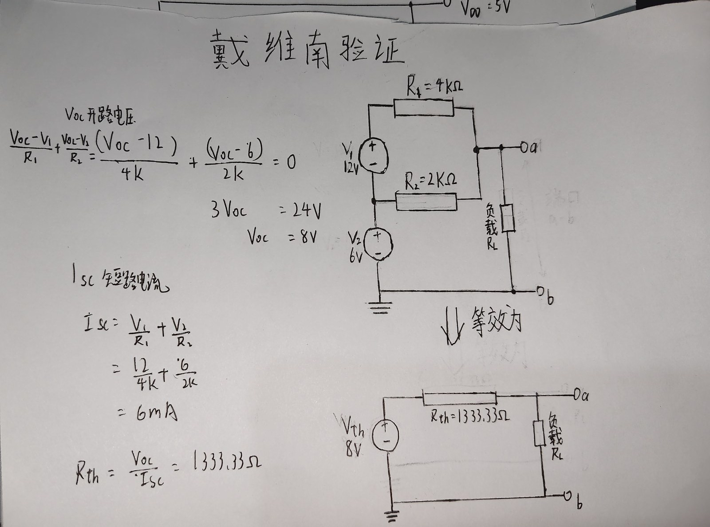
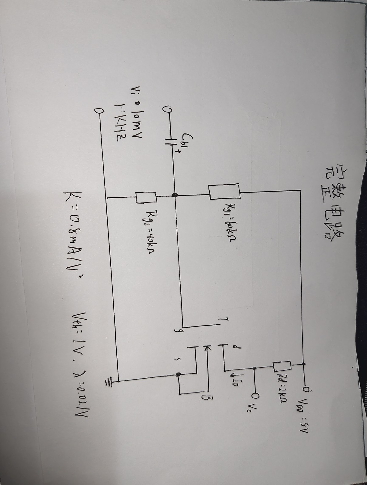
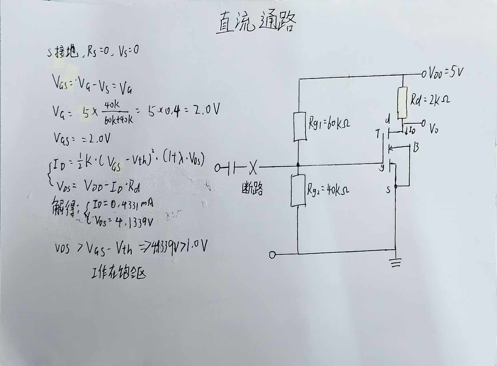
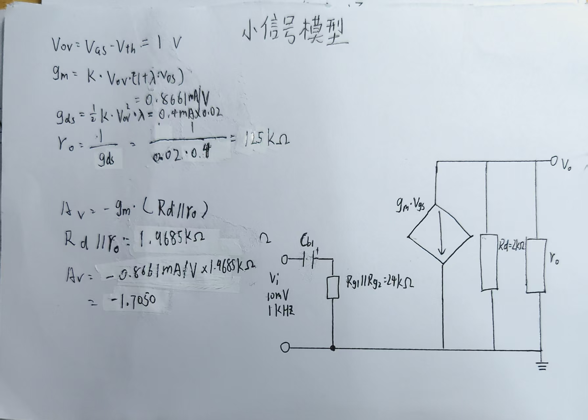

# 贪吃蛇（AI 自动演示版）

一个纯前端单文件贪吃蛇小游戏。**拿到 15 分即为胜利**，胜利后弹出整屏胜利界面，由玩家自己决定「继续玩」还是「重新开始」；AI 能自己一直走到把整盘填满为止，全程无需任何人工输入。

- 仓库：<https://github.com/firewoodwood/firewood>（公开）。线上可直接玩：
  <https://firewoodwood.github.io/firewood/>（GitHub Pages），贪吃蛇在 `/snake/index.html`
- 纯前端单文件，**双击 `snake/index.html` 即可运行**，无框架、无构建、无外部依赖
- 阶段一：可手动玩，键盘控制，可随时**暂停**或**结束本局**
- **胜利条件：拿到 15 分**。达成时弹出整屏胜利界面（包括奖杯、得分、蛇长、步数），由玩家选择「继续玩」（分数与蛇都保留）或「重新开始」
- 阶段二：AI 自动演示，匀速前进，一直走到铺满全部 400 格
- **食物生成保证有解**：只在「蛇头沿回路向前可达」的格子里生成，不会出现够不到的死局
- 新增功能：**主题切换**、**多局战绩**、**计分制**（三项都实现了）
- 另有交互与反馈：**暂停 / 结束本局**、**蛇头辨识度**、**吃食物的粒子与 +1 反馈**

---

## 一、如何运行

1. 下载本仓库，双击 `snake/index.html`（Chrome / Edge / Firefox 均可）；或先打开根目录 `index.html` 从首页进入。
2. 手动玩：方向键 `↑ ↓ ← →` 控制，可以一直玩下去（理论上能一直玩到铺满棋盘 400 格，但手动很难，见第十五节）。
3. 看 AI 演示：点击 **AI自动玩**。
   - AI 是**匀速**的（每步 70ms），刻意调慢以增加可看性，否则会卡。
   - 一局会一直走到全盘填满，约 **2 万步**、**24 分钟左右**。想更快就改 `snake/index.html` 里的 `AI_TICK_INTERVAL`（值越小越快）；现在这个 70ms 是我手动看着调的，目视上兼顾顺畅和速度。
   - 进度显示在画布下方，形如 `🍽️ 137`。
4. **我自己手动打了将近 100 局**（不是只跑脚本）：后面那几个 bug 和页面问题基本都是这样试出来的 —— 比如"暂停中吃满 15 分、点继续玩之后画布不消失"、"五个界面大小不一样"、"胜利后继续玩食物被蛇身盖住"。这些问题跑脚本跑不出来，得真的坐下来一局一局玩。
5. **暂停 / 继续**：点 **⏸️ 暂停** 按钮，或按 **空格**。暂停时画面盖上「已暂停」提示，按钮变成高亮的「▶️ 继续」。可以反复暂停，不影响任何状态。
   - 暂停键在**开局提示期间隐藏**（还没开始，没有可暂停的东西）；游玩中、恢复倒计时、胜利界面都显示 —— 胜利界面期间它等同于「继续玩」。
6. **结束本局**：点 **💀 结束本局**，等价于蛇死亡——走正常的死亡结算（记录战绩、结算最高分），画面会闪一下红并直接显示结束原因。
   - 工具栏上这三个按钮**按状态各给各的**，不是一套规则：

  | 状态 | ⏸️ 暂停 | 💀 结束本局 | AI自动玩 | 🔄 重新开始 |
  | --- | --- | --- | --- | --- |
  | 开局提示（还没开始） | 隐藏 | 隐藏 | **显示** | 隐藏 |
  | **手动游玩中** | 显示 | **显示** | **隐藏** | **隐藏** |
  | **AI 游玩中** | 显示 | 显示 | **隐藏** | 隐藏 |
  | 暂停 / 恢复倒计时 | 显示 | 显示 | **显示** | 隐藏 |
  | **本局结束**（撞死 / 填满 / 手动结束） | **隐藏** | 隐藏 | **显示** | **显示** |
  | 胜利界面 | **隐藏** | 隐藏 | **隐藏** | **显示**（旁边多一枚「▶️ 继续玩」） |

  - **「AI自动玩」在手玩、AI 玩、胜利界面三种情况下都收起**：手动玩的时候点它会把当前这局直接顶掉，属于危险操作；AI 已经在跑时它更是彻底没用（处理函数开头就是 `if (aiMode) return;`）；胜利界面上界面自己已经给了三个选择。它只在**没有对局在跑**时出现（开局提示、暂停中、本局结束）。
  - **游玩中不放「重新开始」**：那一局还在跑，旁边常年摆一个"重新开始"很容易误触；真要走就点「结束本局」，它同样会把这一局记进战绩，语义也更清楚。
  - **结束之后反过来**：已经没什么可"结束"的了，这时才出现「重新开始」；同时把暂停键收起来 —— 那一局已经结束，按"继续"也没有可继续的东西。
  - **胜利界面期间工具栏只留「重新开始」和它右边那枚「▶️ 继续玩」**：再摆一排别的按钮会让人犹豫点哪个；这两个正好是这时候仅有的两个选择 —— 接着玩，或者重开一局。
7. 一局结束后（撞死 / 手动结束 / 把全盘填满），点 **🔄 重新开始** 或 **AI自动玩** 即可无限制地开下一局。
   - 达标时工具栏上会多出一枚 **▶️ 继续玩**，就排在 **🔄 重新开始** 右边；两个选择在同一行里，不必去够鼠标。
   - **空格键按状态有四种含义**：开局提示上=开始、游玩中=暂停/继续、**本局结束（撞死 / 手动结束 / 填满）后=重新开始**、胜利界面上=继续玩。
   - **玩到一半想收手就点「💀 结束本局」**：它会把这一局记进战绩（分数与局数都算），不会白玩，战绩里标成 🔄"玩家自己叫停"。停在开局提示上时这些按钮都是隐藏的，点不到。

无需 `npm install`，无需本地服务器。`localStorage` 在 `file://` 下可能被浏览器限制，代码已用 `try/catch` 包住所有读写，最坏情况只是「最高分/主题/战绩不保存」，不影响游戏。

---

## 二、文件结构

```
.
├── index.html                  # 个人主页 + 作品 + 报告索引（单文件 HTML/CSS）
├── README.md                   # 本文件（第七节是完整的电路报告）
├── LICENSE                     # MIT 许可证
├── snake/                      # 小游戏（阶段一 + 阶段二）
│   ├── index.html              #   游戏本体（HTML + CSS + JS 全在这一个文件里）
│   ├── tools-verify-ai.js      #   本地验证：AI 能否铺满全盘 + 食物有解性
│   ├── tools-verify-15points.js#   本地验证：AI 能否连吃 15 个不死（对应任务书原文）
│   └── tools-verify-controls.js#   本地验证：暂停 / 结束本局 的行为
├── profile/                    # 个人简介
│   ├── profile.html            #   简介的源文件（A4 打印样式）
│   └── 林淮哲-个人简介.pdf      #   成品 PDF（单页）
└── circuits/                   # 进阶挑战：三个电路的 PySpice 仿真
    ├── plot_setup.py           #   出图统一配置（中文字体 / Agg 后端）
    ├── circuit1_rc_lowpass.py  #   电路① RC 低通滤波
    ├── circuit2_thevenin.py    #   电路② 验证戴维南定理
    ├── circuit3_mosfet_cs.py   #   电路③ NMOS 共源级放大
    └── output/                 #   出图（6 张仿真图 + 5 张手绘电路图）
```

根目录的 `index.html` 既是**首页入口**也是**个人主页本身**：上方是自我介绍，中间是作品（贪吃蛇、电路、简介 PDF），最下方是**报告索引**，把本次提交的全部报告集中列出。部署到 Pages 后 `https://firewoodwood.github.io/firewood/` 打开就能一次看全。

`profile/`、`circuits/` 以及 `snake/tools-verify-*.js` 都**不是游戏运行所需**，删掉都不影响 `snake/index.html`。

> **提交范围说明**：任务书第二节的**个人网站**在 [`index.html`](index.html)、**个人简介 PDF** 在 [`profile/`](profile/)，两项都已完成。进阶挑战选了**电路**这一项，详细内容（电路图、手算推导、仿真数据、对比表、踩坑记录）见本文件**第七节**。

`snake/index.html` 内部分区（按代码中的注释区块）：

| 区块 | 作用 |
| --- | --- |
| 核心参数 | 棋盘尺寸、tick 间隔、战绩上限、效果时长 |
| 初始化 / 重置 | `initGame` / `resetGame` |
| 食物生成 | `generateFood`，只在蛇头向前 1~(L+1) 格内生成（保证有解） |
| 核心移动 | `moveSnake`，碰撞判定与结算 |
| AI 决策核心 | `decideMove` / `getCycleMove` / 哈密顿回路常量 |
| 循环与节奏 | `tickDelay` / `scheduleTick` / `stopLoop`（匀速，每 tick 走 1 步） |
| 动画帧循环 | `startAnim`，30fps 独立刷新画面，与游戏节奏解耦 |
| 暂停 / 结束 | `togglePause` / `finishRound` / `updatePauseButton` |
| 反馈效果 | `spawnEatEffects` / `spawnDeathEffect` / `updateEffects` |
| 结束与战绩 | `endGame` / `recordRound` / `renderHistory` |
| 绘制 | `drawCanvas` / `roundRectPath`（含蛇头眼睛、上浮文字、各覆盖层） |
| 交互 | 键盘（含空格暂停）、暂停/重启/AI/结束/主题 五个按钮 |

---

## 三、个人框架 + AI 辅助

这个作业的三块东西（贪吃蛇、个人网站、电路仿真）都是**我先搭框架、再让 AI 辅助实现**。

具体来说，每一块我都会先定下四件事，自己尝试部分代码，然后才去写提示词：

1. **要达成什么**，而且是可检验的说法。比如"AI 连续吃 15 个食物不死"这样能被脚本数出来的目标，
   而不是"AI 要聪明一点"。
2. **用什么结构实现**。这一步是我自己判断的，AI 给方案我对照着选。
   选完我会要求它把关键约定收敛到一处定义，避免同一个概念在两处各写一遍。
3. **怎么验证**。每一块我都要求留下能重复跑的检查手段，而不是"打开看了一眼没问题"。
4. **哪些属于验收项**。功能做完之后，我拿任务书的验收标准逐条对代码，
   缺什么补什么（"局数"就是这么发现漏掉的）。

AI 在这套流程里承担的是**写实现**这件事：代码怎么组织、语法细节、库怎么调，交给它效率高得多。
但**方向、结构、验收边界和"这东西到底对不对"的判断在我这边**。

三个很具体的例子：

- **哈密顿回路那次**，AI 前后给出两版构造方案，长度和格子唯一性都是对的，读代码也通顺，
  **但回路根本不闭合**。这个错是写脚本逐条校验相邻性查出来的，光看代码看不出来。
  后来改成我用 Pósa 算法离线生成、再用同一套脚本验 0 断点。
- **电路那三个脚本**，我"看代码觉得对"，但真实错误是拿对比表抓出来的：
  K 和 SPICE 的 KP 混淆导致 I_D 差一倍、`100 @ u_F` 生成的是 100 法拉、
  相位判据恒为假。这三个都不是看代码能发现的，是**手算和仿真摆在同一个表里对出来的**。
- **首屏打不开那个 bug**，我此前所有验证都是把代码当文本抽出来跑逻辑，
  从来没真加载过页面。是我的验证方式有盲区，不是 AI 写错；后面补了页面级冒烟测试才覆盖到。

三块东西具体怎么分工，在 **第十二节** 的对照表里逐项列了。

---

## 四、我做了什么、新增/修改了什么、为什么

我完成的原始版本是一份能手动玩、且带有一个"BFS 寻路 AI"（寻路部分来自网络上查找的源码）的贪吃蛇。

### 4.1 修复了原版 AI 的两个硬缺陷

**缺陷一：BFS 的四个方向错位。**

原代码里：

```js
const dirs = [[0,1,'right'],[0,-1,'left'],[1,0,'down'],[-1,0,'up']];
for (const [dx, dy, dir] of dirs) {
    const nx = pos.x + dx;   // [0,±1] 本意是 x 偏移，却写成了 dx = 0
    const ny = pos.y + dy;   // y 偏移写在第二位，应为 [±1,0]
```

标着 `'right'` 的那一项实际算出的是 `(x+0, y+1)`，也就是「下」；标着 `'down'` 的算出来反而是「右」。四个方向整体错位，而且 `dir` 变量取了却从未使用。后果是 BFS 扩展的不是真正的四邻域，只在同一行/列内跳跃，同时把大量格子误标记为 `visited` 造成错误剪枝——寻路时灵时不灵。

**改法**：把方向抽成唯一的 `DIR_VECTORS` 常量，AI 寻路和真实移动共用同一份，从结构上杜绝"算法认为的方向"和"蛇实际走的方向"不一致。

```js
const DIR_VECTORS = [
    { name: 'up',    dx: 0,  dy: -1 },
    { name: 'down',  dx: 0,  dy: 1  },
    { name: 'left',  dx: -1, dy: 0  },
    { name: 'right', dx: 1,  dy: 0  }
];
```

**缺陷二：回退策略完全不做安全校验。**

原版在 BFS 找不到路径时调用 `getDirectionToTail()`，它只算「蛇头指向蛇尾的向量」并返回 `abs` 较大的那个方向，既不检查是否会撞墙、也不检查是否会撞到自己身体。AI 会主动把头撞进墙或自己的身体里。

**改法**：整体换成下面 4.3 的策略。

### 4.2 修复的其他问题

| 问题 | 原写法 | 改法 |
| --- | --- | --- |
| 食物生成可能"试不出来" | 随机试探 1000 次，失败再双重循环扫描 | 改为按"有解"约束在候选范围内取（见 4.4），不存在试不出来的情况 |
| 污染浏览器原生 API | `CanvasRenderingContext2D.prototype.roundRect = ...` 给所有 canvas 打全局补丁，覆盖原生 `roundRect` | 改成普通函数 `roundRectPath(ctx, ...)`，只在本文件内生效 |
| 胜负状态混乱 | `aiMode` / `aiStopped` / `winFlag` 多个标志互相耦合，AI 成功时靠连写三行 `statusTip` 覆盖 | 收敛为 `aiMode` + `aiResult` + `startAI()` 入口，`endGame(message, result)` 统一结算 |
| AI 失败后无法重开 | 重启按钮只清 `aiMode` 却不清定时器，AI 模式的速度会残留到手动模式 | `startAI()` 内部先 `initGame()` 起一局干净的，再接管 |
| localStorage 在 `file://` 下抛异常 | 直接调用 | `safeGet` / `safeSet` 包 `try/catch` |
| AI 每帧重复建索引 | 每帧重建 `Map` 和占用集合 | 回路索引只在初始化时建一次 |

### 4.3 AI 的实现：哈密顿回路（这是阶段二的核心）

**结论先行**：AI 走的是 20×20 棋盘上一条**预先算好的哈密顿回路**——一条经过全部 400 个格子、且首尾相接的闭合环路。蛇只需要沿着它一直往前走。

**为什么这样就绝不会死：**

蛇身任何时候都是这条回路上**一段连续的弧**。既然身体在回路上连续，那么"蛇头在回路上的下一个格子"必然不属于身体（身体只占了头后面的那些格子），因此**那一格永远空着**。吃到食物时蛇变长，只是这段弧向头部方向延长一格，连续性不受影响。

所以「不撞墙、不撞自己」不是靠概率或启发式保证的，而是几何上的必然结果；又因为回路遍历全盘，每个食物迟早都会经过，所以 AI 可以**一直安全地玩下去**，直到把全盘填满。

**流程：**

```
点击「AI自动玩」
      ↓
initGame() 起一局干净的对局（初始蛇形落在回路上、朝向与回路一致）
      ↓
每个 tick（固定 1 步）：getCycleMove()
      ├─ 查 cycleIndex 得到蛇头在回路上的序号 i
      ├─ 目标是 route[i+1]
      ├─ 若万一被占（理论上不会），沿回路向后找最近的空且相邻格
      └─ 返回该方向；吃到食物则更新进度继续
      ↓
（手动模式）吃到第 15 分 → 弹胜利界面，停住等玩家选「继续玩 / 重新开始」
      ↓
一直循环
      ↓
直到 snake.length 达到 400（全盘填满）→ endGame(…, 'full')
```

**关于"胜负"与"无限游玩"**：胜利条件是**拿到 15 分**（`WIN_SCORE = 15`）。达成时**不自动结算**，而是弹出胜利界面让玩家选：

- 「继续玩」：分数和蛇都原样保留，接着玩（胜利界面在同一局里不再重复弹）
- 「重新开始」：按正常流程开新一局

所以"无限游玩"仍然成立，只是现在多了一个 15 分的里程碑供玩家自己决定要不要继续。

另外两个结局都不是"胜利"，而是这局自然结束：

- `'full'` —— 棋盘 400 格被蛇铺满，物理上再放不下食物。这不算赢也不算输，提示是「这局到头了」。
- `'fail'` —— 撞墙或咬到自己（💀）。

AI 演示时**不弹胜利界面**：AI 模式本来就是要一路填满全盘的，中途停下来等点击会打断演示。`WIN_SCORE` 只在手动模式下触发。

**关于回路的构造**（这段是我踩坑最多的地方）：

- 回路是一份**离线预计算、以常量形式内嵌在代码里**的 `CYCLE_ROUTE` 数组，共 400 项。
- 生成方法用的是 **Pósa 旋转-扩展法**：先从起点随机游走到不能走，得到一条路径；然后对路径末端做"旋转"（把末端在路径上的邻居后面的子路径整体反转），让末端换人不丢顶点，从而不断延长路径；覆盖全盘后，找一个与起点相邻的末端即得回路。
- 之所以内嵌而**不在运行时算**：在 20×20 上跑一次 Pósa 实测约 **1.3 秒**，放在页面启动路径上会让加载明显卡顿。回路与游戏逻辑无关、永不变，属于纯数据，离线生成一次即可。
- `buildCycleRoute()` 启动时会调用 `assertCycleRoute()` 自检：检查长度是否为 400、格子是否唯一、**含首尾闭合的每一条边是否都相邻**、以及初始蛇形是否确实躺在回路上且朝向一致。不自洽会在控制台告警。

**初始蛇形为什么在正中间**：初始的三节蛇必须满足两个硬条件——**落在回路上**、且**蛇头的回路序号最大**（否则 AI 接管时蛇头前方的回路格会被自己身体占用）。在满足这两个条件的位置里挑"最靠棋盘中心"的一段，得到：

```
蛇头 (9,9)，身体 (9,10) 与 (10,10)，方向 up
```

20×20 棋盘的中心是 (9.5, 9.5)，这三格到中心的曼哈顿距离**都是 1**，所以开局就在正中。这个位置不是手挑的，是在回路上按"距中心最近"筛出来的（筛选脚本 `_center.js`，用完已删；判定条件就写在脚本注释里）。

### 4.4 食物生成必须"有解"（这条要求是后加的，也是必须的）

**问题**：随便在空格里撒食物会产生死局。蛇身始终是回路上的一段连续弧，蛇**只能沿回路向前走**；如果食物落在蛇头**后方**的格子上，蛇得绕整整一圈才能吃到，而当蛇很长时那一圈全是自己的身体——根本绕不过去，这一局就废了。

**改法**：把食物候选范围限制为「从蛇头沿回路向前 1 ~ (L+1) 格」（L 为当前蛇长），并且上界还要同时不超过剩余空格数——蛇长超过一半之后，能放的位置本来就在变少。

- **起点取蛇头前 1 格**：不能生成在蛇头脚下，否则白送一个，看起来像 bug。
- **上界取 L+1**：吃到之后蛇长变成 L+1，此时蛇身刚好是一段首尾相接、长度 L+1 的弧（头和尾在回路上相邻），"身体是连续弧"这个不变式继续成立。放得更远的话，吃到后头尾之间就会断开，不变式被破坏。
- 这个范围里**必然有空格**（蛇长 L 小于总格数，且上界 ≥ 1），所以不会无解；万一没有，代码**直接抛错**暴露问题，而不是静默退化成"随便找个空格"——那种兜底会悄悄破掉有解性。

**这个改动有个意外优点**：食物总在蛇头附近，平均一个食物只要约 50 步（原来满盘随机撒约 200 步），一局从约 12 万步降到约 **2 万步**，演示快得多，玩家游玩的时间也可以相应减短。

`tools-verify-ai.js` 里加了对应校验：每 50 步抽查一次当前食物是否满足 `1 ≤ 前向距离 ≤ L+1`。

### 4.5 新增功能

**① 主题切换**（验收：至少 2 套配色 、 一键切换即时生效 、 刷新后保留）

- 用 CSS 自定义属性定义浅色 `:root` 与深色 `[data-theme="dark"]` 两套配色，切换时只改根元素上的属性，所有颜色即时生效。
- 选择写入 `localStorage`（键 `snakeTheme`），启动时读取并恢复。
- **按钮文案说的是"点下去会变成什么"，不是"当前是什么"**：日间模式显示 `🌙 切换夜间模式`，夜间模式显示 `☀️ 切换日间模式`。文案在 `applyTheme()` 里跟着主题一起更新 —— 启动读存储、点按钮切换，都走这一条路径，不会漏。
  - ☀️ 后面带了一个变体选择符（`U+FE0F`）：它默认会被当文字字形渲染成黑白，加上才强制彩色 emoji 呈现；🌙 本身默认就是彩色 emoji，不需要加。
- 注意：canvas 里的颜色**不会**被 CSS 变量自动影响，所以 `drawCanvas()` 里也按当前主题选了对应色值，并在切换后主动重绘。

**② 多局战绩**（验收：记录最近 10 局 / 新一局自动追加 / 可查看完整列表）

- 右侧面板显示最近 10 局，每行是 `#局号 · 模式 · 结果图标 + 得分`，最新一局在最上面。
- 图标按"这一局是怎么结束的"分四种：

  | 图标 | 含义 |
  | --- | --- |
  | ✅ | 把全盘铺满，自然走完 |
  | 🔄 | **玩家自己叫停**：手动结束本局，或玩到一半点「重新开始」 |
  | 💀 | 手动模式下撞死 |
  | 🤖 | AI 演示中撞死（实际很少见，AI 基本不会撞） |

  后两者只表示"死了"，前两者是"自己停的"，分开标才好分辨 —— 尤其是重开的那一局，
  它同样是有效的一局（分数会记下来），不该和撞死混在一起。
  实现上 `recordRound()` 多收一个 `endedByUser` 标记，`outcome` 本身仍保持
  `'fail' | 'full'` 两个值，所以 `aiResult` 的语义没被动过。

- **手动打到 15 分及以上，成绩旁边多一个 🏆**（跟在上面那个图标右边，比如
  `💀🏆 16`、`🔄🏆 15`）。它和结束方式那个图标是两件事 —— 后者说"这局怎么结束的"，
  奖杯说"这局打到了达标线"，所以两个都留着。
  - **AI 的局不加奖杯**：AI 那条路线本来就会一路吃到铺满全盘，局局都有奖杯，
    反而看不出哪一局值得夸。
  - 判据就是 `item.mode !== 'AI' && item.score >= WIN_SCORE`，用的是同一个
    `WIN_SCORE`（15）常量，不另写魔数。
- 每局结束（无论胜负）由 `recordRound()` 追加一条到 `localStorage` 的 `snakeHistory`，超过 10 条就 `slice(-10)` 丢掉最旧的。
- 开局前就读取并渲染，所以刷新页面后战绩仍在。

**③ 计分制**（验收：记录得分/最高分/局数 / 新一局不清零 / 有重置按钮）

- 得分与最高分实时显示在顶部，最高分写入 `localStorage`（键 `snakeHighScore`），新开一局**不清零**。
- 局数有两处：顶栏的 **🎮 N 局**（累计总局数，与最高分同样写 `localStorage`，刷新保留），以及战绩列表里的 `#局号`（最近 10 局内的序号）。
- 「🔄 重新开始」按钮即重置按钮。

### 4.6 暂停 / 结束本局

**暂停（`togglePause`）**

- 入口有两个：**⏸️ 暂停** 按钮，以及**空格键**。空格放在键盘处理的最前面，也不受「AI 接管」影响，AI 跑起来也能随时按下暂停。
- 实现上是**直接停掉游戏定时器**（`stopLoop`）。恢复时不立即 `startLoop`，而是先走 3 秒倒计时（见 4.9），倒计时结束才真正重新起循环。不是"标记一个 paused 然后每帧跳过"，因为那样定时器还在空转；停掉更干净，也让 `moveSnake` 里那道 `if (paused) return` 成为双保险。
- 暂停期间**屏蔽方向键**：否则玩家按下的转向会在恢复后突然生效，看起来像"多走了一步"。倒计时期间同样屏蔽，理由见 4.9。
- 画面上的「已暂停」覆盖层由独立的动画循环绘制（见下），所以即使游戏逻辑停摆，覆盖层照样显示。
- 按钮会切换成高亮的 `▶️ 继续`，加上状态栏文案，两处都能看出当前是暂停态。
- **四个按钮的显隐都在 `updatePauseButton()` 里按状态算**（判 `roundInProgress` / `gameOver` / `winScreenVisible`）：
  - `inRound`（`roundInProgress`）：有一局正在跑 -> 暂停键与「结束本局」显示
  - `win`（`winScreenVisible`）：胜利界面期间工具栏只留「重新开始」（旁边多一枚「▶️ 继续玩」），暂停键、「结束本局」、「AI自动玩」都收起
  - `over`（`gameOver && !winScreenVisible`）：本局已结束 -> 给「AI自动玩」与「重新开始」（暂停键此时收起）
  - 「AI自动玩」：`!inRound && !win` 时才显示（见 4.5 的取舍）
  - 开局提示期间只剩「AI自动玩」（此时 `roundInProgress` 与 `gameOver` 都为假）
  - 用 `display:none`（而不是 `visibility:hidden`），否则按钮行里会留一个空档。
  - 文案与高亮**无论显隐都照常更新**：若隐藏时跳过更新，按钮会留着上一局的旧文案（比如停在「▶️ 继续」），下一局显示出来就是错的 —— 这个坑是测试断言抓出来的。

**结束本局（`finishRound`）**

- 按"结束 = 死亡"这条要求，**等价于蛇死亡**：直接调 `endGame('你结束了本局', 'fail', true)`，走和撞死**完全同一条**收尾路径——因此战绩、最高分、AI 进度、绘制结算的行为自动与撞死一致，不需要另写一套。第三个参数只标记"是玩家自己叫停的"，用来在战绩里换个图标（🔄 而不是 💀），不影响任何收尾逻辑。
- 结束时会把 `paused` 清掉并复位按钮：否则会出现"结束画面还写着暂停"的怪状态。
- 结束后暂停键失效（`togglePause` 首行 `if (gameOver) return`）。

**为什么要拆出一个独立的动画循环（`startAnim`）**

游戏逻辑由 `setTimeout` 自调度驱动，但**画面刷新不能挂在它上面**：暂停时逻辑已经停摆，可覆盖层还得显示；结束时死亡闪屏也要能自己闪完。所以另起一个 30fps 的 `setInterval` 只做「推进效果 + 重绘」。这个循环与游戏逻辑完全解耦，游戏逻辑也不依赖它——所以在无头测试里它跑不跑都不影响验证结论。

### 4.7 胜利界面（15 分）与「继续玩 / 重新开始」

胜利条件是 `WIN_SCORE = 15` 分。达到时**不自动结算**，而是整屏弹出胜利界面，交给玩家决定：

```
        🏆
       胜利！
   吃到了 15 个食物
  15        18        213
  得分      蛇长      步数
 要继续玩下去，还是重新开一局？

  [🔄 重新开始]  [▶️ 空格继续]  [🌙 切换夜间模式]
```

「▶️ 空格继续」不在画布上，而是**画布下方工具栏里的一枚按钮，就排在「🔄 重新开始」右边** —— 达标时它才出现，两个选择在同一行里。

| 选择 | 行为 |
| --- | --- |
| ▶️ 空格继续 | 分数与蛇**原样保留**，接着玩下去；界面关掉后先走 3 秒倒计时（见 4.9）再开跑。胜利界面在同一局内不再出现。按钮文案直接写出**空格**这个按键，画布上的提示也写着「按空格继续玩，或重新开一局」—— 键盘和鼠标两条路都指得明明白白 |

**为什么做成整屏而不是一条横幅**：最初只做了画面底部一条横幅，太容易被当成普通提示略过——玩家可能压根没意识到"这已经是胜利了"。现在做成整屏的金色界面，展示内容（奖杯、得分、蛇长、步数）画在 canvas 上。

实现要点：

- **按钮是真实 DOM 按钮，不是画在 canvas 上**。画在 canvas 上就得自己处理点击坐标命中，而且键盘和读屏都用不了；用 `<button>` 这些全是白送的。按钮区带 `role="status" aria-live="polite"`，出现时读屏会播报。
- **`winShown` 与 `winScreenVisible` 是两件事**，这是我实现时踩到的坑：前者表示"本局已经弹过了"，会一直保持 `true`；后者表示"此刻正在显示"，点「继续玩」后必须关掉。一开始我拿 `winShown` 当绘制条件，结果点「继续玩」之后胜利界面一直盖在画面上——**实测画布金色像素 1571 → 18 才确认它真的消失了**。
- **出现时把游戏停住**（复用暂停那套 `stopLoop()`）。否则玩家还没看完，蛇就已经撞墙了。同时用 `winPausedByBanner` 记住"这次暂停是界面造成的"，这样点「继续玩」时不会把用户自己按下的暂停给解开。
- **顺手清掉粒子与「+1」上浮文字**：它们会飘在胜利界面上面，实测奖杯上会叠一个 `+1` 残影。
- **界面造成的暂停不画暂停覆盖层**：覆盖层上写着「按空格或点「继续」恢复」，而胜利界面旁边就有「▶️ 继续玩」，两句话说的是同一件事，叠在一起只会让人犹豫点哪个。（胜利界面期间暂停键本身也是收起的，见 4.6。）
- **AI 演示不触发**：AI 模式的任务是一路填满全盘，中途停下等点击会打断演示。`checkWinScore()` 里判 `aiMode` 直接返回。

界面上的**步数**由 `stepCount` 统计，每次成功走一步加一（撞死那一步不计，因为提前 `return` 了），随新一局清零。

### 4.8 开局提示界面

每局开始**先停在一屏提示上**，而不是一打开蛇就已经在动：

```
🎯 本局目标
   15 分
吃到 15 个食物就算赢
⬆️⬇️⬅️➡️  方向键移动
空格键随时暂停 / 继续
按空格键或点这里开始      
```

- 打开页面、点「重新开始」、胜利界面里点「重新开始」，**三条路径都先停在这一屏**。
- 开始方式有两种：**按空格**或**点画面**（提示上写着"点这里"）。提示期间鼠标移到画布上会变成手型。
- 提示期间**不排 tick**（不让游戏逻辑跑），所以蛇一动不动，也不会因为手慢而开局就撞死。方向键在这个阶段被忽略。
- 空格在提示期间的含义是"开始"而不是"暂停"——**一个键四种含义，按状态区分**：

  | 状态 | 空格键的含义 | 界面上的提示 |
  | --- | --- | --- |
  | 开局提示 | 开始这一局 | 「按空格键或点这里开始」 |
  | 游玩中 | 暂停 / 继续 | 「空格键随时暂停 / 继续」 |
  | 本局结束（撞死 / 手动结束 / 填满） | **重新开始**（不必去够鼠标） | 状态栏结尾「—— 按空格重新开始」 |
  | 胜利界面 | 继续玩（等于点「▶️ 空格继续」） | 按钮文案「▶️ 空格继续」+ 画布「按空格继续玩，或重新开一局」 |

  **四种含义都在界面上写出来了**，不用玩家自己猜空格当前管什么。

  顺序要紧：先判 `roundPending`，再判 `winScreenVisible`，最后才判 `gameOver`。
  胜利界面期间 `winScreenVisible` 与 `gameOver` 可能同时为真，颠倒过来会让空格
  在胜利界面上变成"重新开始"。

**为什么不做成"自动消失的提示"**：那样玩家很可能还没看清目标提示就没了、蛇也开始动了；而且一旦开局撞墙，可能会"没反应过来"。停住等一次明确输入，多一次按键，多许多体验感。

### 4.9 恢复前的 3 秒倒计时

从**暂停**或**胜利界面**切回游戏时，不立刻开始跑，先给 3 秒缓冲：

```
        3
    准备开始…
 倒计时期间暂停与转向不响应
```

**为什么加它**：切回来那一瞬间玩家的手指还在原来的位置（刚点完鼠标、或刚按完空格），蛇立刻按上次的方向动，很容易一上来就撞死——尤其暂停前正在贴墙走的时候。倒计时让玩家先看清盘面、把手指放回方向键上，再开始。

**这 3 秒里刻意什么都不响应**：

| 输入 | 倒计时期间 |
| --- | --- |
| 空格键 | 不响应 |
| 主界面的「暂停」按钮 | 不响应 |
| 方向键 | 不响应（`nextDirection` 不变） |

理由是一致的：倒计时本身就是为了"先别急着操作"，如果这期间还能按暂停或转向，它就失去意义了；而且转向在画面还没跑的时候按下去也看不到反馈，反而让人误以为已经开始了。

实现要点：

- **倒计时期间 `paused` 保持 `true`**。这样 `scheduleTick()` 里那道 `if (gameOver || paused) return` 就是现成的双保险——即使有残留的定时器也不会推进逻辑，不用再造一个"正在倒计时所以别走"的状态。
- **推进挂在动画循环上**。暂停时逻辑定时器是停的，页面上唯一还在跑的就是那个 30fps 的 `setInterval`，所以把 `updateCountdown()` 放进它里面，顺便让数字能动。
- **只在"从静止切回运行"时启动**。开局提示（`beginRound`）**不加**倒计时——那一屏本来就要求玩家按键才开始，再叠 3 秒是多余的。
- **时间基准要和绘制一致**。`drawCanvas()` 里用的是 `Date.now()`，倒计时一开始我写的是 `performance.now()`，两个基准不同、数字会算错；改成同一来源才对上。
- **不给暂停覆盖层叠加**。倒计时期间 `paused` 也是 `true`，若照旧画"已暂停"那一层，两段文字会糊在一起（截图确认过），所以暂停覆盖层的条件里加了 `!countdownActive()`。
- **中途结束/达标就取消**：`updateCountdown()` 里判 `gameOver`/`winScreenVisible`/`roundPending`，点「结束本局」时也会显式取消，避免倒计时到点后又把循环启动起来。

实测（真浏览器，边点边读状态）：

```
恢复后:   paused=true  cd=true   状态栏="⏱️ 准备好了吗？3 秒后开始"
1 秒后:   cd=true  步数=0（没动）
2 秒后:   cd=true  步数=0（没动）
3.5 秒后: paused=false cd=false  步数=3（已开始跑）
胜利后点继续玩: paused=true cd=true  胜利界面已关
倒计时中点暂停按钮: 无反应
再等 3.5 秒: paused=false cd=false  步数继续增长
```

### 4.10 蛇头辨识度

原实现的蛇头只是"和蛇身同色、略亮一点"的方块，快速移动时根本认不出头在哪。现在的做法是：

1. **眼睛**：按当前方向在头部两侧画两只眼睛（白眼球 + 朝向行进方向的深色瞳孔）。这是蛇头唯一的辨识手段，也是**最关键**的一条——一眼就能看出蛇在往哪走，而不只是"哪个是头"。
2. **光晕**：头部 `shadowBlur` 16（身体只有 3~7），静静地区分出头部位置。

**尺寸和颜色刻意与身体保持一致**：

- 头部不再放大，内缩 2.5px、圆角 4px，两者都与身体一致。
- 头部也不再单独调亮，用的是跟"紧邻头的那一节身体"**同一个颜色公式**（`bodyColor(1, isDark)`）， 所以衔接处不会突然出现一个亮色块。

这两点是最初实现里用过的"让头显眼"的办法（头部放大一圈 + 固定亮绿 `#39e07b`），后来按反馈去掉了：**膨胀和变浅会让头看起来像一块贴上去的东西，眼睛本身就足以定位**。

眼睛位置用与前进方向垂直的单位向量 `(-dy, dx)` 算出，所以四个方向都正确。

### 4.11 反馈机制

原则是**只做"看得懂发生了什么"**，不加背景音、不加弹窗打断操作：

| 事件 | 反馈 |
| --- | --- |
| 吃到食物 | 食物位置炸开 8 颗小点（带轻微下坠）+ 上浮 `+1` 淡出 |
| 蛇死亡 | 整屏闪一下红（320ms 淡出） |
| 手动结束本局 | 同上（因为走的同一条死亡路径） |
| 画面上的结束原因 | 结束覆盖层里直接写出原因（如「你结束了本局」），不用低头看状态栏 |
| 暂停 | 画面盖「已暂停 / 按空格或点「继续」恢复」 |
| 恢复 / 继续玩 | 画面盖半透明层，中央从 3 数到 1，期间暂停与转向都不响应 |
| 得分变化 | 顶部得分与进度栏即时更新 |
| 食物位置 | 带呼吸感（`sin` 缩放）与中心高光，比原来更容易找到 |

粒子 / 文字都是短生命周期的纯视觉对象，按 `Date.now()` 计算寿命（不用帧数），所以动画时长不会随 AI 速度变化。它们在 `effectsReset()` 里随新一局清空。

---

### 4.12 修一个"页面颤动"的 bug（吃食物时界面会抖）

**现象**（学生报告）：恢复粒子效果之后，有时吃食物会觉得页面在颤。

**排查**：没有靠肉眼看，而是在页面里装了 `PerformanceObserver`（layout-shift）
并逐帧比对**所有元素的 `getBoundingClientRect`**，跑 40 个食物，把每一次几何变化
连同当时的状态一起打出来。结果定位到两件事：

| 现象 | 根因 | 修法 |
| --- | --- | --- |
| 顶栏右侧的分数区宽度在 **331 ↔ 336** 之间跳 | 数字**不等宽**：`0`/`1` 比 `2~9` 窄，分数每跳一次整行宽度就变一次 | `font-variant-numeric: tabular-nums` |
| 分数从 **9 变 10** 时整页上下移 3~7px | 分数区宽度**跟着内容走**，两位数一来右侧撑宽约 19px；内容刚好超过视口高度时垂直对齐方式还会切换一次 | ① 给**数字**留一个固定宽度的槽（不是把整条写死，见下）；② 垂直居中改用 `margin: auto`（`safe center` 的"放不下就退回顶部"本身就是位移）；③ `overflow-y: scroll` 常驻滚动条 |

修完实测：分数 0~399 全区间里三条计数条的宽度**恒定 84.8 / 84.8 / 107.7px**，
无文字截断；吃 14 个食物、210 帧采样，**几何变化 0 次**（粒子仍照常炸开）。

**后来按学生要求又调了一次布局**：三条计数条改成**贴着内容、左对齐**，
左侧留白恒等于内边距（14px）—— 之前是把整条宽度写死 + 右对齐，结果内容较窄的
「🍎 0」左边空出 55.7px，而内容较宽的「🎮 399 局」只空 14px，左边看起来不齐。
现在的做法两头都顾上：**整条贴内容**（左侧留白一致），但**数字本身占一个固定宽度的
槽**（按三位数预留），所以位数变化时动的只是数字在槽内的位置，整条宽度不变。

**四个坑值得记下来**（都是实际踩到的）：

1. **只给 `min-width` 没用**。flex 项的"自动最小尺寸"默认就是它的内容宽度，
   声明 `min-width: 58px` 时，双位数一来仍然会把行撑宽。
2. **`flex-basis` 也会被内容顶开**。试过把槽宽写成 92px，结果实际算出 331px ——
   因为槽里是「emoji + 数字 + 14px 内边距」，3 位数时内容本身要 111px。
   要 `flex: 0 0 134px` **加上 `min-width: 0`**（后者解除"自动最小尺寸"这个
   下界，前者才说了算）—— 不过这一版最终没走这条路，见第 4 条。
3. **`safe center` 解决不了"整页跳"**。它的语义是"放不下就退回顶部对齐"，
   而"退回"这个动作本身就是位移：内容高度刚好跨过视口高度（900 → 901.34）时
   整页跳 2.92px。正确的是 `margin: auto`（放得下居中、放不下从顶部开始，
   两种情况位置连续），外加 `overflow-y: scroll` 让滚动条常驻 —— 否则
   滚动条"出现/消失"还会改可用宽度，而 canvas 是流式宽度
   （`width:100%` + `aspect-ratio:1`），宽度一变高度也跟着变。
4. **`span` 这类标签选择器要写成直接子选择器**。` .score-area span` 会把
   胶囊背景和 `padding: 6px 14px` 一路套到内层的数字槽上，把 30px 的槽撑成
   58px —— 表现就是"明明写死了宽度却还在变"。改成 `.score-area > span`
   并把内层显式复位（`background: none; padding: 0`）才对。

**顺带说明**：达标那一刻（分数到 15）工具栏会多出一枚「▶️ 继续玩」，页面高度
因此变化、整体位置动几像素。这是**功能本身**，不是 bug —— 它是"有东西出现了"，
不是"画面在抖"。

### 4.13 五个界面尺寸统一

要求：开始 / 手动游戏 / AI 玩 / 死亡 / 胜利，五个界面的卡片大小必须一样。

**改之前的实测**（这也解释了"为什么以前每个界面大小都不同"）：

| 界面 | 卡片 | 画布 | 工具栏 |
| --- | --- | --- | --- |
| ① 开始 | 653 | **404** | 44 |
| ② 手动游戏 | 692.1 | **443.1** | 44 |
| ③ AI 玩 | 692.1 | 443.1 | 44 |
| ④ 死亡 | 699.3 | **450.3** | 44 |
| ⑤ 胜利 | 729.8 | **470.8** | **54** |

两个根因：

1. **画布是流式尺寸**（`width: 100%` + `aspect-ratio: 1/1`），卡片一变宽它就跟着变高；
2. 而**卡片宽度是 `fit-content`**，各界面显示的按钮数不同（开始 1 个、游戏中 3 个、
   胜利 2 个加一个提示条），宽度就不同 —— 画布于是也跟着不同。

**改法**（三处，都写在 CSS 里）：

| 改什么 | 怎么改 | 为什么 |
| --- | --- | --- |
| 画布 | `width/height: 400px`（去掉 `width:100%` + `aspect-ratio`） | 写死之后它在所有界面都是 400×400，也正好是 canvas 的内部分辨率，绘制最清晰 |
| 卡片宽度 | `width: 470px`（去掉 `fit-content`） | 470 = 内边距 35×2 + 画布 400；宽度不再随按钮数变 |
| 工具栏 | `height: 102px`（原来没有高度） | 按钮多时会换行，不固定的话它从 1 行长到 2 行，界面间就差在这里。定成两行是因为按钮最多的界面本来就会换行 |
| 卡片高度 | `min-height: 720px` | 兜住"胜利提示条比别的界面多出约 10px"。720 是按内容最高的界面留的 |

**改完实测**：五个界面一律 **卡片 470×720、画布 400×400、工具栏 400×102**，
且没有界面内容溢出。

**工具栏里每个按钮的位置也要统一**（学生随后提出）。原来的问题：

| 界面 | 「主题」按钮位置 | 原因 |
| --- | --- | --- |
| 开始 | **第一行**（y=0） | 只显示 AI + 主题两个按钮 |
| 手动 / AI / 死亡 | 第二行（y=58） | 按钮多，换行了 |
| 胜利 | 第二行（y=68） | 胜利提示条再多占一点 |

也就是说"第几个格子"这种横向位置稳不住 —— 换行位置会随按钮个数变。
所以改用**行尾**当锚点：给「主题」加 `margin-left: auto`，把它推到**本行的行尾**。
行尾是唯一在按钮数变化时仍然稳定的位置。

配套还要把按钮**收紧**（内边距 24px → 12px、字号 16px → 14px）：最挤的一行是
胜利界面的「重新开始 + 胜利提示 + 主题」，原来要 415px，超过卡片内宽 400px，
「主题」就会被挤到第二行。收紧之后五个界面里「主题」的位置完全一致
（实测都是 249,0），且除胜利外都只占一行。

**一点代价**：固定尺寸之后，按钮少的界面（开始、胜利）工具栏里会留一块空白 ——
这是"五个界面一样大"的必然结果，不是漏改。截图确认过观感可以接受。

### 4.14 食物被蛇身覆盖

**现象**（学生报告）：胜利之后继续玩，食物会被蛇身盖住。

**排查**：先怀疑是逻辑问题 —— 食物生成到了蛇身上。于是写了个检查器，每走一步
就核对"食物格是否与任一节蛇身重合"，跑了两轮共 200 多次检查（普通游玩一轮、
胜利→继续玩一轮），**重合 0 次**；`generateFood()` 里也确实用 `occupied`
集合排除了蛇身（并且只在一处给 `food` 赋值）。所以逻辑没问题。

**真正的原因在绘制顺序**：`drawCanvas()` 里食物画在**蛇之前**。食物本身不占满
整格（半径约 `cellSize/2 - 3`），而蛇身方块带 `shadowBlur` 光晕、圆角外扩 ——
一旦食物紧邻或贴着蛇身，后画的蛇就把食物盖掉了。玩家在"胜利后继续玩、蛇变长"
的时候最容易撞见，因为长蛇更容易贴住食物。

**改法**：把食物那一段挪到**蛇之后**绘制（顺带画一圈与背景反差大的白边，
让它贴在深色蛇身上也能看清轮廓）。

**验证**（按像素判断，不靠肉眼）：

| 场景 | 该格像素分布 |
| --- | --- |
| 食物压在蛇身格（修前应为 0 个食物色） | 食物红 59 + 食物金 12 + 蛇绿 99 |
| 食物在空地（对照） | 食物红 105 |
| 食物紧贴蛇头 | 食物红 105 |

截图确认：长蛇身上能看到清晰的红色食物圆点（带白边）。

> 插一句：我第一次的像素检查是**取格中心一个点**，结果取到了蛇眼睛/高光上，
> 误判成"仍被覆盖"。改成统计整格的像素分布才看准 —— 判定一个东西"在不在"，
> 单点取样太脆。

**回归**：控制脚本 91 项全过；15 分脚本 15 局全达标；AI 铺满 2/2、
食物可达范围 0 违例。

## 五、通用素养说明

任务书第三节「通用素养」里有几项是**纯文字说明**（分支/合并、命令行、两步验证），代码里体现不出来，所以集中写在这一节。

### 5.1 什么是「分支」和「合并」

简单来说：

> **分支（branch）**是从主线（通常是 `main`）上分出来的一条独立开发线，在上面改动不会影响主线。
> **合并（merge）**是把某条分支上的改动并回主线，让主线也拥有这些改动。

两者的关系：**分支是为了"改动时不打扰主线"，合并是为了"改完把成果收回主线"。**

举个具体的例子——假设我要给贪吃蛇加一个"音效"功能：

```bash
git checkout -b add-sound     # 从 main 分出一条叫 add-sound 的分支
# ……在分支上改代码、commit 若干次，main 完全不受影响……
git checkout main             # 切回主线
git merge add-sound           # 把分支的改动合并进 main
```

这样做的好处是：**音效功能做了一半发现不好、或者做坏了，只要不合并，`main` 上的游戏始终是能跑的**。如果直接在主线上改，就得靠手动回退来收拾。

> 说明：本项目是一个单人、单文件的小项目，改动量小、不需要并行开发，所以**全程直接在 `main` 上提交**，没有实际用到分支，上面的例子只是为了说明概念。

### 5.2 命令行命令的用途

任务书提到的四条（`cd` / `ls` / `mkdir` / `git`），逐个说明用途，并给出**在本项目里实际怎么用**：

| 命令 | 用途 | 在本项目里的实际用法 |
| --- | --- | --- |
| `cd` | **c**hange **d**irectory，切换当前工作目录 | `cd circuits` 进入电路目录，才能跑那三个仿真脚本（脚本按相对路径取 `output/`） |
| `ls` | **l**i**s**t，列出当前目录下的文件 | `ls output/` 看这次仿真生成了哪几张 PNG；`ls` 确认自己在哪个目录、有什么文件 |
| `mkdir` | **m**a**k**e **d**irectory，新建目录 | 建一个 `output/` 用来放仿真出图（脚本里也用 `os.makedirs(OUT_DIR, exist_ok=True)` 做了同样的事） |
| `git` | 版本控制，记录每次改动 | 见下表 |

在 Windows 上用 PowerShell 时，`ls` 和 `mkdir` 是**别名**（分别对应 `Get-ChildItem` 和 `New-Item -ItemType Directory`），`cd` 两边通用

`git` 常用子命令：

| 命令 | 用途 |
| --- | --- |
| `git init` | 把当前目录初始化成一个 Git 仓库（本项目只做一次） |
| `git status` | 看现在有哪些文件改了、哪些已经暂存 |
| `git add <文件>` | 把改动放进"暂存区"，准备提交（`git add -A` 是全部） |
| `git commit -m "说明"` | 把暂存区的内容提交成一个版本，附一句说明 |
| `git log --oneline` | 查看提交历史（本项目用它确认提交次数） |
| `git remote add origin <地址>` | 把本地仓库和 GitHub 上的远程仓库关联起来 |
| `git push origin main` | 把本地提交推送到 GitHub 的 `main` 分支 |
| `git checkout -b <名字>` | 新建并切换到一条分支 |
| `git merge <名字>` | 把某条分支合并进当前分支 |

### 5.3 两步验证（2FA）

**已开启。** 用 **Authenticator 应用**（基于 TOTP 的动态验证码）绑定 GitHub 账号，登录时除了密码还要再输入应用里每 30 秒刷新一次的 6 位验证码。

为什么加它：GitHub 账号一旦被盗，攻击者可以直接以我的名义改代码、删仓库，甚至用我的身份提交内容。而密码是可能被撞库、被钓鱼的——**2FA 的第二个因子是"我手上的设备"，光有密码拿不到它**。对公开仓库来说，重点不只是代码本身，还有"这个仓库确实是我在维护"这件事。

ps：这一步属于任务书第三节「信息与安全意识」的要求，**必须在 GitHub 账号设置里操作，代码仓库里体现不出来**，所以在此留档说明。

---
## 六、我如何验证的（阶段一可玩性 + 阶段二 AI 达标）

### 阶段二：AI 达标验证（关键证据）

我用 Node 把 `snake/index.html` 里的 `<script>` 抽出来，在 `node:vm` 里用最小的 DOM / Canvas / localStorage 桩跑起来，并用**可复现的伪随机种子**替换 `Math.random` 控制食物生成，然后驱动 AI 跑完整局。

```bash
node tools-verify-ai.js 12 200000    # 12 局，每局步数上限 200000
```

实测结果：

```
========================================
  AI 无头验证结果
========================================
  终局条件      : 蛇身铺满全部 400 格（游戏本身可无限开新局）
  总局数        : 12
  步数上限/局   : 200000
  铺满全盘      : 12  (100.0%)
  未铺满        : 0
  平均步数/局   : 20479.8  (min 19250, max 21336)
----------------------------------------
  「食物有解」约束检查
  抽查次数      : 4921 次（每 50 步一次）
  违例          : 0  ✓ 食物始终落在蛇头向前可达范围内
----------------------------------------
  演示时长（每 tick 1 步，匀速）
  AI 帧间隔     : 70ms
  平均步数/局   : 20480 步
  单局墙钟时长  : 1433.6 秒
========================================
```

**12 局全部铺满 400 格，0 失败；食物有解约束 4921 次抽查 0 违例。** 与 4.3 / 4.4 的理论预期一致。

不过上面这个口径比任务书**更严**（任务书只要求"连续吃完 15 个食物不死"，而这里跑到了铺满全盘）。所以我另写了一个专门对应任务书原文那一条的脚本，判定更直接：吃到 15 分就停，中途只要 `gameOver` 就算不达标。

```bash
node tools-verify-15points.js 100 4000    # 100 局，每局步数上限 4000
```

```
  达标（连吃 15 个不死）: 100 / 100
  中途死亡                      : 0
  超步数上限未达标              : 0
  达标局平均步数                : 91.2
  达标局最坏步数                : 119
```

**100 局 100% 达标，平均 91.2 步、最坏 119 步就拿到 15 分。** 写这个脚本时踩了一个坑记在下面，因为它会让验证结果**假性通过**：

> `startAI()` 开头有 `if (aiMode) return;` 守卫，所以**连着调用它并不会开新局**。我第一版就是每局调一次 `startAI()`，结果第 2 局起分数还停在上局的 15 分，循环一进去就判定"达标"，跑出"平均 3.6 步达标"这种明显不合理的数。改成每局先 `initGame()`（它会把分数、蛇、`aiMode`、`gameOver` 全部复位）才拿到真实数据。**这类"验证脚本自己有 bug"比被测代码有 bug 更危险，因为它给出的是绿灯。**

单局墙钟时长是**算**出来的：页面匀速（每 tick 1 步、70ms），测试直接调 `moveSnake` 绕过了定时器，所以用「总步数 × 70ms」得到。改速度时，脚本里的 `AI_TICK_MS` 需要和 `snake/index.html` 的 `AI_TICK_INTERVAL` 保持一致（代码里有注释提醒）。

> **一条性能上的注意事项**：这个脚本默认**短路掉绘制**。原因是 `moveSnake` 每步都会调 `drawCanvas`，而它在无头环境里要经过一层 JS 桩函数；实测 `drawCanvas` 约 1.24ms/次、AI 决策只要 0.027ms/次，绘制占了 98% 的运行时间，12 局会从 9 秒涨到 10 分钟以上。绘制是**纯副作用、不改变任何游戏状态**，跳过它不影响这里要验证的胜负、步数、食物有解性。想连绘制一起测：`VERIFY_RENDER=1 node tools-verify-ai.js 2 200000`（在 `snake/` 目录下执行）。真实绘制由浏览器验证覆盖。

我还做了端到端的行为验证：走 `startAI()` 这个正式入口，用受控定时器驱动，确认

- 手动模式间隔 150ms、AI 模式 70ms（模式切换正确）；
- 铺满全盘后游戏自行停止，`aiResult === 'full'`、进度栏显示 `✅ 填满全盘`；
- 战绩记录里这一局被正确标注为 `mode: "AI"`、`result: "full"`。

（这里我一开始写错过：`endGame` 先把 `aiMode` 置为 `false`，导致后面 `recordRound` 读到的模式永远是「手动」。已改为在清除前先存下 `wasAI`。）

### 暂停 / 结束本局 的专项验证

`tools-verify-controls.js` 专门覆盖这两个功能（含恢复时的 3 秒倒计时），共 **91 项断言全部通过**：

```bash
node tools-verify-controls.js
```

| 验证点 | 实测 |
| --- | --- |
| 开局提示期间暂停键隐藏 | ✓ `pauseHidden=true` |
| 开局后暂停键显示 | ✓ `pauseHidden=false` |
| 暂停后 500 次 `moveSnake` 无任何推进 | ✓ 蛇长 24→24、得分 21→21 |
| 暂停时按钮文案 / 高亮 / 状态栏 | ✓ `▶️ 继续`、高亮、提示「已暂停」 |
| 恢复时先走 3 秒倒计时 | ✓ 倒计时 2998ms、期间 `paused` 仍为 true、按钮仍是「继续」 |
| 倒计时期间按暂停键 | ✓ 无反应（不会把倒计时取消） |
| 倒计时期间 300 次 `moveSnake` | ✓ 食物计数 21→21，无推进 |
| 倒计时走完 | ✓ `countdownActive=false`、`paused=false`、按钮变回「暂停」 |
| 倒计时结束后继续推进 | ✓ 吃到食物 21 → 85 |
| 反复暂停/恢复 20 轮 | ✓ 状态不错乱、游戏未意外结束 |
| 结束本局 = 蛇死亡 | ✓ `gameOver=true`、`winFlag=false`、`aiResult='fail'` |
| 结束时清除暂停状态 | ✓ 从暂停态结束，`paused` 被复位、按钮复位 |
| 结束后暂停键隐藏 | ✓ `pauseHidden=true`（且文案已复位为「暂停」） |
| 手动游玩中 | ✓ 暂停=显示、结束本局=显示、AI自动玩=**隐藏**、重新开始=隐藏 |
| AI 游玩中 | ✓ 暂停=显示、结束本局=显示、AI自动玩=**隐藏** |
| 本局结束（含撞死） | ✓ 暂停=**隐藏**、结束本局=隐藏、AI自动玩=显示、重新开始=显示 |
| 胜利界面 | ✓ 工具栏只留「重新开始」，另三个全收起；横幅是「继续玩 / 返回」两个 |
| 开局提示 | ✓ 只给「AI自动玩」 |
| 胜利界面点「返回」 | ✓ 胜利界面关闭、回到开局提示、分数归零、AI自动玩重新出现 |
| 玩到一半点「重新开始」 | ✓ 计局数（1→2）并记下分数 7、标为玩家叫停 |
| 提示期间点「重新开始」 | ✓ 不记战绩、不计局数（那一局没开始过） |
| 结束写入战绩 | ✓ `{score:86, mode:'AI', result:'fail', won:false}` |
| 结束后可再开新局 | ✓ 得分归零、最高分保留 86、战绩保留 |

### 阶段二：真实浏览器端到端验证

无头脚本验证的是逻辑层，我另外用 **Edge 无头浏览器加载真实的 `snake/index.html`** 做两件事。

**(a) 正常跑一段**（点真实的「AI自动玩」按钮），确认新格式与交互：

| 检查项 | 实测结果 |
| --- | --- |
| 初始状态栏 | `⬆️⬇️⬅️➡️ 方向键控制` |
| 点击后状态栏 | `🤖 AI 自动操作中（无需任何键盘输入）...` |
| 点击后进度 | `🍽️ 0`（**不再有 `/ 399` 上限**） |
| 运行中的进度 | `🍽️ 22`（约 12 秒内吃到 22 个，节奏与 70ms/步相符） |
| 主题切换 | 点一次 → `dark`；再点一次 → 恢复浅色 |
| 运行时错误 | **0** |
| `assertCycleRoute()` 自检告警 | **0** |

**(b) 单独验证"填满全盘"的收尾分支**：完整一局要 24 分钟左右，浏览器里等不完，所以用注入局面 + 走一步的方式直接触发终局：

| 检查项 | 实测结果 |
| --- | --- |
| 注入局面 | 蛇长 399、蛇头 `(0,1)`、唯一空格 `(0,0)` |
| 走一步后蛇长 | **400**（全盘填满） |
| 终局状态栏 | `🎉 蛇身铺满全部 400 格，这局到头了（全程零人工操作）。点「重新开始」再来一局` |
| 终局进度 | `✅ 填满全盘`（不是"胜利"语义） |
| 战绩面板 | `#1 AI ✅ 1` |
| 点「重新开始」后 | `🔄 新的一局！`，得分归 0、**最高分保留**、战绩保留 1 条 |
| 运行时错误 / 自检告警 | **0 / 0** |

> (b) 用的是临时注入钩子（只改局面、不改判定逻辑），验证完已从 `snake/index.html` 中移除，现在的文件里没有这段代码。这样安排是因为：完整跑完一局在 70ms/步下要 24 分钟，而终局分支必须被真正执行过才算验证。

**(c) 暂停 / 结束本局 的按钮行为**（同样在真实浏览器里点真实按钮）：

| 检查项 | 实测结果 |
| --- | --- |
| 五个按钮 | `⏸️ 暂停` / `🔄 重新开始` / `AI自动玩` / `💀 结束本局` / **主题按钮（文案随当前主题变）**（后两个按状态出现：游玩中给「结束本局」，结束后给「重新开始」；「AI自动玩」在手玩/AI玩/胜利界面时收起） |
| 点暂停 | 状态栏 `⏸️ 已暂停 —— 按空格或点「继续」恢复`，按钮变 `▶️ 继续` |
| 暂停 2.5 秒 | **得分冻结**（10 → 10，不动） |
| 点继续 | 按钮复位 `⏸️ 暂停`，得分继续涨（10 → 15） |
| 点结束本局 | `💀 你结束了本局`，进度 `❌ 结束`，战绩 `#1 AI 🔄 15`（🔄 表示玩家自己叫停） |
| 结束后再点暂停 | 正确失效（按钮文案不变） |
| 点重新开始 | `🔄 新的一局！`，得分归 0、**最高分保留 15** |
| 运行时错误 / 自检告警 | **0 / 0** |

**(d) 视觉反馈与蛇头辨识度**：这一项无法靠断言判断，我直接**截图看**（把画布放大 2.25 倍渲染出来检查），确认：

- 蛇头与紧邻的身体方块**尺寸相同、颜色相同**，衔接处没有突兀色块；
- 蛇头靠两只眼睛辨识，瞳孔朝向当前行进方向（截图中朝下，与蛇的实际走向一致）；
- 食物带呼吸感与中心高光，比原来的纯色圆点更容易找到；
- 死亡时整屏红色闪屏 + 💀 + 画面上直接写出结束原因；
- 暂停时画面盖上「已暂停 / 按空格或点「继续」恢复」。

截图核验用的临时探针文件在验证后已全部删除。

### 一次真实的漏测，以及补上的页面级冒烟

上面那些验证有一个共同点：**都是把 `index.html` 当纯文本读出来、抽 `<script>` 在 `node:vm` 里跑逻辑**。逻辑层测得很细（游戏里 56 个函数、400 局 AI、91 项控制断言），但**从来没有把一个真实页面加载起来看它能不能用**。

结果就漏掉了一个只有浏览器里才会暴露的问题：启动时 `applyTheme()` 先于 `initGame()` 执行，而 `applyTheme()` 会立刻重绘，此时蛇还是空数组 → `head.x` 抛 `TypeError` → 整个 `bootstrap()` 被打断 → **画面只有草地和食物、没有蛇、也不能玩**，点一下「重新开始」又正常。详情见第十三节第 15 条。

补的做法是加一类**页面级冒烟**：用 iframe 真正加载页面，然后

- 读 canvas 像素统计"蛇绿"与"食物红"的像素数 → 确认蛇真的画出来了（修复前蛇绿 = **0**，修复后 = **968**）；
- 观察得分是否推进（修复后 2 秒内得分 0 → 3）；
- 点「AI自动玩」确认能接管（进度 `🍽️ 8`）。

| 修复后实测 | 结果 |
| --- | --- |
| 加载瞬间 | 蛇绿 968 像素、食物红 167 像素 |
| 2 秒后 | 蛇绿 1496 像素、得分 3（蛇在动、在吃） |
| 点 AI | `🤖 AI 自动操作中`，进度 `🍽️ 8` |
| 页面运行时错误 | **0** |

**探针有个坑值得记**：页面里的 `snake` / `score` / `paused` 都是**顶层 `let`，不会挂到 `window` 上**，所以 `w.score` 读出来永远是 `undefined`。一开始据此以为"拿不到内部状态、没法验证"，其实只要用 `w.eval('...')` 在**页面自己的作用域**里执行就行。这跟第六节里"验证脚本要在末尾追加导出垫片"是同一个坑的两种表现。

### 开局提示 + 胜利界面的验证

用 `w.eval()` 直接驱动页面内部状态，一次跑完全部分支（无需真的玩到 15 分）：

| 检查点 | 实测结果 |
| --- | --- |
| 开局 | 停在**提示界面**、游戏循环未启动、得分 0、蛇长 3（蛇头 (9,9)，居中） |
| 提示期间按方向键 | 被忽略（`nextDirection` 不变） |
| 按空格开始 | 提示消失、`roundPending=false`、**游戏循环启动** <br>状态栏回到 `⬆️⬇️⬅️➡️ 方向键控制` |
| 吃到第 15 分 | 得分 **15**、**胜利界面出现**（画布金色像素 1571）、**游戏暂停**、`winShown = true` |
| 界面内容 | 奖杯 + `胜利！` + `吃到了 15 个食物` + 三个统计（得分 15 / 蛇长 9 / 步数 213）——这里是用 `w.eval()` 直接把 `score` 置到 15 触发的，所以蛇长还是当时的 9；正常玩到 15 分时蛇长是 18（初始 3 + 吃 15 个） |
| 点「继续玩」 | **界面从画布消失（金色像素 1571 → 18）**、暂停解除、**得分仍为 15**、循环仍在跑、之后还能继续吃（15 → 16） |
| 同一局重复触发 | 不再弹（`checkWinScore` 的 `winShown` 生效） |
| 点「重新开始」 | **回到开局提示界面**、循环停止、得分归 0、步数归 0、蛇长回到 3、`winShown` 复位 |
| 「重新开始」按钮 | 同样回到提示界面、循环未启动 |
| 点「AI自动玩」 | **跳过提示**（`roundPending=false`、`aiMode=true`） |
| 页面运行时错误 | **0** |

### 可玩性验证

- 逐项手测：方向键响应、不能 180° 反向、吃到食物加分、撞墙/咬到自己结束并给出提示、重启按钮、主题切换即时生效且刷新保留、战绩刷新保留。
- 逻辑层回归：无头环境跑通「手动模式」下的移动与碰撞分支（`tools-verify-ai.js` 复用了同一套 `moveSnake`）。
- 暂停 / 结束本局 / 恢复倒计时 / 按钮显隐与点击接线：见上面 `tools-verify-controls.js` 的 91 项断言。
- 页面级冒烟：见上一节。
- **浏览器渲染验证**（读真实 DOM 与 canvas 像素）：
| 检查项 | 实测结果 |
| --- | --- |
| 页面标题 | `贪吃蛇` |
| 初始状态栏 | `⬆️⬇️⬅️➡️ 方向键控制` |
| canvas 2D 上下文 | 取得成功，尺寸 `400x400` |
| canvas 实际绘制 | 采样到 1650 个非空像素点（确实画上了内容，非空白画布） |
| 战绩面板挂载 | 存在，无记录时显示空态提示 |
| 主题切换 | 点一次 → `dark`；再点一次 → 恢复浅色，可来回切换 |
| 重新开始按钮 | 状态栏变为 `🔄 新的一局！` |
| 运行时错误 / 自检告警 | **0 / 0** |

### 验证环境说明

浏览器验证需要给 Edge 更宽的权限才能启动——无头模式要创建命名管道做进程间通信，而默认沙箱禁止打开命名管道（`platform_channel.cc:183 Check failed`）。除此之外的所有验证都在默认沙箱内完成。

`snake/` 下那三个 `tools-verify-*.js`（AI 铺满全盘 / 连吃 15 分 / 暂停与结束本局）都是本地验证工具，**不是游戏运行所需**，删掉不影响 `snake/index.html`。保留它们是为了让上面的结论可以复跑出来。

---

## 七、进阶挑战（电路）的验证结果

进阶挑战我选的是**电路**这一项。三个电路的完整内容在下面 7.1~7.8 节（含电路图清单、手算推导、仿真设置、对比表、踩坑过程）。

```bash
cd circuits
python circuit1_rc_lowpass.py    # 电路① RC 低通滤波
python circuit2_thevenin.py      # 电路② 验证戴维南定理
python circuit3_mosfet_cs.py     # 电路③ NMOS 共源级放大
```

（Windows 下若控制台是 GBK 代码页，脚本会在打印 µ/²/λ 这类字符时抛 `UnicodeEncodeError` 直接中断，先设 `PYTHONIOENCODING=utf-8`。）

| 电路 | 核心结论 | 手算 vs 仿真 |
| --- | --- | --- |
| ① RC 低通滤波（R=1 kΩ, C=100 nF） | τ = 100 µs、fc = 1591.55 Hz、fc 处相移 −45° | τ 偏差 < 0.15%，fc 偏差 −0.24%，fc 处相移 −44.93° vs −45° |
| ② 验证戴维南定理（V1=12V/R1=4k, V2=6V/R2=2k） | V_oc = 8 V、I_sc = 6 mA、R_th = 1333.33 Ω | 五项全部 0.00% 偏差；**五种负载下原网络与等效电路的电压/电流偏差全为 0** |
| ③ NMOS 共源放大（题目给定参数） | V_GS = 2 V、I_D = 0.4331 mA、V_DS = 4.1339 V（饱和区）、gm = 0.8661 mA/V、ro = 125.00 kΩ、Av = −1.7050 | 静态工作点偏差 **0.0000%**；瞬态与交流增益均 −1.7050，与手算 −1.7050 差 0.00% |

每个电路都按题目要求：手绘电路图、手算过程与公式、PySpice 仿真数据、以及「理论值 vs 仿真值」对比表。

> **电路图由手绘提供，代码里不含任何"画电路示意图"的逻辑**——原先用 matplotlib 画过一版（`circuit3_mosfet_cs.py` 里约 210 行），已按要求整体删除。
> 脚本现在只负责仿真计算与**仿真波形图**（瞬态、Bode、V-I 曲线）。已画好的 **5 张**图清单见下面 **7.1 节**。

做这一部分时踩的坑不比做游戏少，其中几个值得一提（详见下面 7.7 节）：

- 把题目的 K 和 SPICE 的 KP 搞混，I_D 差了整一倍。这个错是对比表抓出来的。
- **`100 @ u_F` 生成的是 100 法拉而不是 100 微法**，耦合电容成了短路，增益系统性偏大。把网表打出来看才发现。
- **模型参数名写成 `lambd`，λ 被 ngspice 静默忽略**。它表现为"AC 增益不随 λ 变化"，我一度误判成"ngspice 的 level-1 不计 λ"，还并了一只电阻去代表 ro。真正原因是参数名必须写完整的 `lambda`。详见 7.7 第 4 条。

> 任务书第二节要求的个人简介 PDF 与个人网站均已完成，分别在 [`profile/`](profile/) 与 [`index.html`](index.html)。

---

**电路这块的分工**：三个脚本的结构是我定的（每块拆成"理论手算 / 网表搭建 / 仿真与对比表"三段，对比表是核心产出），仿真代码由我粗略写， AI 完成。参数与结论的正确性靠手算对照来保证：7.7 节记的五个坑，有四个是"手算和仿真不一致"暴露出来的，另外一个是验证方式本身的盲区。AI 负责把它写出来，我负责判断它算得对不对。

### 7.1　手绘的图（共 5 张，已画好）

| 编号 | 画的是什么 | 文件名 | 用在哪一节 |
| --- | --- | --- | --- |
| 图 1 | RC 低通滤波电路（R = 1 kΩ、C = 100 nF、Vi / Vo 端口） | [`hand_c1_rc_circuit.jpg`](circuits/output/hand_c1_rc_circuit.jpg) | 7.4 |
| 图 2 | 含源二端网络 **+** 戴维南等效电路（画在同一张的右侧上下两半） | [`hand_c2_network.jpg`](circuits/output/hand_c2_network.jpg) | 7.5 |
| 图 3 | NMOS 共源放大完整电路（VDD、Rg1、Rg2、Rd、Cb1、NMOS） | [`hand_c3_amplifier.jpg`](circuits/output/hand_c3_amplifier.jpg) | 7.6 |
| 图 4 | 直流通路（Cb1 断开） | [`hand_c3_dc_path.jpg`](circuits/output/hand_c3_dc_path.jpg) | 7.6 |
| 图 5 | 小信号等效模型（中频） | [`hand_c3_small_signal.jpg`](circuits/output/hand_c3_small_signal.jpg) | 7.6 |

> **关于数量**：题卡第 4 页对电路② 要求「**等效电路替换后**接负载的电压/电流验证表」，加上通用要求「每个电路都要有自己画的电路图」，所以电路② 需要原网络和等效电路两样。这两样我画在了**同一张纸的上下两半**（图 2），对照着看反而更直观。
> 电路③ 的直流通路与小信号模型，题卡第 2 页要求「画出」，我**分成两张画**（图 4、图 5），因为每张旁边都要写对应的手算过程。

**手算过程写在哪**：题目要求手算的 5 项，前四项（V_GS、I_D、V_DS、饱和判据）都是直流量，写在**图 4 直流通路**旁边；第五项（gm、Av）是小信号量，写在**图 5 小信号模型**旁边。图上直接写了公式和数值，README 7.6 节里也有完整推导。

画图时标上的量（都是后面对比表里用到的）：

- **图 1**：R = 1 kΩ、C = 100 nF、标出 Vi / Vo
- **图 2**：V1 = 12 V、R1 = 4 kΩ、V2 = 6 V、R2 = 2 kΩ，端口 a-b（b 为地）
- **图 2 右下（等效电路）**：V_th = 8 V、R_th = 1333.33 Ω，端口 a-b 接负载 R_L
- **图 3**：VDD = 5 V、Rg1 = 60 kΩ、Rg2 = 40 kΩ、Rd = 2 kΩ、Cb1 足够大，以及 NMOS 的 K / V_th / λ
- **图 4**：Cb1 开路、栅极靠 Rg1/Rg2 分压
- **图 5**：要有 `gm·vgs` 受控源、`ro`、`Rd`，并体现 **ro 与 Rd 是并联**的

---

### 7.2　环境与运行

三个电路各自独立运行：

```bash
cd circuits
python circuit1_rc_lowpass.py    # 电路① RC 低通滤波
python circuit2_thevenin.py      # 电路② 验证戴维南定理
python circuit3_mosfet_cs.py     # 电路③ NMOS 共源级放大
```

中文显示这块，`plot_setup.py` 会自动挑系统里能用的中文字体（这台机器上挑到的是 Microsoft YaHei）， 后端强制用 `Agg`（没有图形界面，不设会卡住）。每个脚本开头都会打印一行 `中文字体: xxx`， 看一眼就知道图上的中文有没有变成方框。

---

### 7.3　文件结构

```
circuits/
├── plot_setup.py                 # 出图统一配置（中文字体 / Agg 后端 / 风格）
├── circuit1_rc_lowpass.py        # 电路① RC 低通滤波
├── circuit2_thevenin.py          # 电路② 验证戴维南定理
├── circuit3_mosfet_cs.py         # 电路③ NMOS 共源级放大
└── output/                       # 出图
    ├── c1_rc_transient_bode.png  #   [仿真] 方波瞬态 + 幅频特性
    ├── c1_rc_phase.png           #   [仿真] 相频特性
    ├── c2_thevenin.png           #   [仿真] 原网络 vs 等效电路 + 最大功率传输
    ├── c2_thevenin_vi.png        #   [仿真] 端口 V-I 外特性
    ├── c3_transient.png          #   [仿真] 输入/输出波形（反相放大）
    ├── c3_bode.png               #   [仿真] 幅频与相频
    ├── hand_c1_rc_circuit.jpg    #   [手绘] 图 1 RC 低通电路
    ├── hand_c2_network.jpg       #   [手绘] 图 2 含源二端网络 + 戴维南等效
    ├── hand_c3_amplifier.jpg     #   [手绘] 图 3 共源放大完整电路
    ├── hand_c3_dc_path.jpg       #   [手绘] 图 4 直流通路
    └── hand_c3_small_signal.jpg  #   [手绘] 图 5 小信号等效模型
```

---

### 7.4　电路① RC 低通滤波电路

#### 电路图 1：RC 低通滤波



> 手绘：R = 1 kΩ、C = 100 nF，标出了 Vi / Vo 端口，旁边写了 τ = RC = 100 µs 与 f_c = 1/(2πRC) = 1591.55 Hz 的推导。
#### 元件取值与理论计算

题目允许自定元件值，取 **R = 1 kΩ、C = 100 nF**（这样 τ = 100 µs、fc ≈ 1.59 kHz，配 1 kHz 输入很合适）。

**时间常数**

```
τ = R·C = 1×10³ Ω × 100×10⁻⁹ F = 1×10⁻⁴ s = 100 µs
```

**截止频率**（输出幅度降到输入的 1/√2 ≈ 0.707，即 −3 dB）

```
fc = 1 / (2πRC) = 1 / (2π × 1×10⁻⁴) ≈ 1591.55 Hz
```

**传递函数与相移**

```
H(jω) = 1 / (1 + jωRC)
|H| = 1 / √(1 + (f/fc)²)
φ = −arctan(f/fc)
   f = fc 时  φ = −45°
   f → 0  时  φ → 0°
   f → ∞  时  φ → −90°
```

#### 仿真设置

- **瞬态**：输入 5 V / 200 Hz 方波（半周期 2.5 ms = 25τ，每个半周期都能充到稳态），步长 τ/200，跑 5 个周期。
- **交流**：10 Hz ~ 100 kHz，每十倍频程 200 点。

#### 理论值 vs 仿真值

| 量 | 手算 | 仿真 | 偏差 |
| --- | --- | --- | --- |
| 时间常数 τ（0→63.2%） | 100.0 µs | 99.9 µs | −0.12%※ |
| 时间常数 τ（10%~90% 上升时间反推） | 100.0 µs | 100.1 µs | +0.14%※ |

> ※ **这两个百分比不要当成"τ 验到了 0.1%"来读。** 这个测法的量化分辨率本身就是
> 采样步长：step = τ/200 = 0.5 µs，也就是 **±0.5%**；而且激励源还有 5 µs 上升时间
> （τ 的 5%）。所以 ±0.15% 完全落在方法噪声内。
> 实测佐证：把源上升时间从 5 µs 改成 1 ns，结果从 −0.115% 变成 **+0.051%**；
> 把步长从 τ/200 改成 τ/2000，变成 **−0.021%**；用纯解析的梯形波 + 0.5 µs 采样，
> 直接给到 **−0.500%**。
> 这里真正有意义的结论只有一条：**实测值确实在 100 µs 量级、方法没有系统性错误**。
> 需要高精度就该换测法（比如拟合整条指数曲线），而不是看这几位小数。
| 截止频率 fc（−3 dB） | 1591.55 Hz | 1587.76 Hz | −0.24% |
| fc 处相移 | −45° | −44.93° | 0.07° |
| 10 Hz 处相移 | ≈0° | −0.36° | — |
| 100 kHz 处相移 | ≈−90° | −89.09° | — |

三条都对得上。fc 上那 0.24% 的偏差**几乎全部来自"−3 dB"的定义差**，不是扫描精度：

| 来源 | 贡献 |
| --- | --- |
| **定义差**：−3.000 dB 与 −3.0103 dB（= 1/√2，也就是 1/(2πRC) 那个点）不是同一个点 | **−0.2372%** |
| 扫描点间隔（每十倍频程 200 点）+ 对数插值 | 0.0009% |

也就是说两者的量级差了约 260 倍 —— 最初我把主次写反了（说成主要来自点间隔）。
结论不变：这 0.24% 跟器件模型没关系，是可解释的定义差。
（解析的 −3.000 dB 点是 1587.774825 Hz，脚本插值给 1587.7609 Hz，插值本身只差 0.0009%。）

> **这里本来还有一个我自己的 bug**：−3 dB 交点的插值我一开始写成
> `x0 + (y0 − (−3.0))·(x1 − x0)/(y1 − y0)`，正确的是 `((−3.0) − y0)`。
> 两个负号相消，插值点被镜像到栅格点的另一侧，实测 fc 出来是 1582.03 Hz
> （偏差 −0.60%）。改对之后是 1587.76 Hz（−0.24%），少了 0.36 个百分点。
> 当时把多出来的误差归给了"扫描点太疏"，其实一半是自己算错的 ——
> **拿手算去校仿真之前，得先确认"读仿真结果"的那段代码本身没错。**

#### 仿真出图


---

### 7.5　电路② 验证戴维南定理

#### 电路图 2：含源二端网络与戴维南等效



> 手绘：左侧是 V_oc、I_sc、R_th 三步推导（`3V_oc = 24 V → V_oc = 8 V`、`I_sc = 12/4k + 6/2k = 6 mA`、`R_th = V_oc/I_sc = 1333.33 Ω`）；右侧上半是含源二端网络（V1 = 12 V 串 R1 = 4 kΩ、V2 = 6 V 串 R2 = 2 kΩ，两路汇到端口 a-b，b 为地，端口上接负载 R_L），正下方是等价的 V_th = 8 V 串 R_th = 1333.33 Ω。
>
> 题目对电路② 要的是「含源二端网络图」和「等效电路替换后接负载」两件事，这里画在同一张图的右侧上下两半，对照着看更直观。
端口 a 是两个支路汇合的那个节点，端口 b 取地。

#### 戴维南等效电路

等效电路画在**图 2 的右下**（方便和原电路对照），所以这里不再单独放图。接同一个 R_L 时，两边的端口电压和电流应该完全一样——实测偏差见下面的验证表。

#### 理论计算

**开路电压 V_oc**：端口悬空，节点 a 的 KCL

```
(V_a − V1)/R1 + (V_a − V2)/R2 = 0
V_a·(1/R1 + 1/R2) = V1/R1 + V2/R2
V_a = (12/4000 + 6/2000) / (1/4000 + 1/2000) = 0.006 / 0.00075 = 8.0 V
```

**短路电流 I_sc**：端口对地短接，V_a = 0

```
I_sc = V1/R1 + V2/R2 = 12/4000 + 6/2000 = 3 mA + 3 mA = 6.0 mA
```

**戴维南等效电阻 R_th**：两个独立电压源置零（短路）后，从端口看进去是 R1 与 R2 并联

```
R_th = R1 ∥ R2 = (4000 × 2000) / (4000 + 2000) = 1333.33 Ω
```

**接上负载 R_L 后的端口电压**

```
V = (V1/R1 + V2/R2) / (1/R1 + 1/R2 + 1/R_L)
```

#### 仿真设置

- **开路**：端口不接任何东西，跑直流工作点读节点电压。
- **短路**：端口对地接 1 µΩ 近似短路线，由 KCL 反推短路电流。
- **R_th 第二种算法**：把 V1、V2 都换成 0 V 源（即短路），端口注入 1 A，测得电压数值上就等于 R_th。
- **接负载验证**：原网络与戴维南等效电路各接同一组负载，逐一对比。
- **最大功率传输**：R_L 从 100 Ω 扫到 20 kΩ（对数 60 点）。

#### 理论值 vs 仿真值

| 量 | 手算 | 仿真 | 偏差 |
| --- | --- | --- | --- |
| 开路电压 V_oc | 8.0000 V | 8.0000 V | 0.00% |
| 短路电流 I_sc | 6.0000 mA | 6.0000 mA | 0.00% |
| R_th = V_oc / I_sc | 1333.3333 Ω | 1333.3333 Ω | 0.00% |
| R_th（独立源置零法） | 1333.3333 Ω | 1333.3333 Ω | 0.00% |

**等效替换后接负载的验证表**

| 负载 | 原网络 V | 等效电路 V | 原网络 I | 等效电路 I | 偏差 |
| --- | --- | --- | --- | --- | --- |
| 开路 | 8.0000 V | 8.0000 V | 0 A | 0 A | 0.00e+00% |
| 10 kΩ | 7.0588 V | 7.0588 V | 0.7059 mA | 0.7059 mA | 0.00e+00% |
| 3 kΩ | 5.5385 V | 5.5385 V | 1.8462 mA | 1.8462 mA | 0.00e+00% |
| 1 kΩ | 3.4286 V | 3.4286 V | 3.4286 mA | 3.4286 mA | 0.00e+00% |
| 500 Ω | 2.1818 V | 2.1818 V | 4.3636 mA | 4.3636 mA | 0.00e+00% |

五种负载下电压和电流的偏差全是 0.00e+00%。也就是说在端口上看，等效电路和原网络没有任何区别， 戴维南定理要证的这件事成立了。

**最大功率传输**（顺带验证的）

| 量 | 理论 | 仿真 |
| --- | --- | --- |
| 峰值位置 | R_L = R_th = 1333.3 Ω | R_L = 1352.1 Ω（扫描点间隔内） |
| 最大功率 | V_oc²/(4R_th) = 12.0000 mW | 11.9994 mW |

#### 仿真出图


外特性是一条直线 `V = V_oc − R_th·I`，斜率就是 −R_th，两端点分别是开路点和短路点。

---

### 7.6　电路③ NMOS 共源级放大电路

#### 电路图（图 3）：完整电路



题目给定了全部参数：VDD = 5 V、Rg1 = 60 kΩ、Rg2 = 40 kΩ、Rd = 2 kΩ、Cb1 足够大、NMOS 的 K = 0.8 mA/V²、V_th = 1 V、λ = 0.02 /V，输入 Vi = 10 mV / 1 kHz 正弦。

因为题目没给 Rs，所以**源极直接接地**，于是 V_GS = V_G。

#### 电路图（图 4）：直流通路



> Cb1 画成断路，输入源被隔离，栅极只由 Rg1/Rg2 分压。**题目要求手算的静态工作点四步就写在这张图旁**（下面「手算静态工作点」一节里是同样的推导）：
>
> ```
> V_GS = V_G = VDD·Rg2/(Rg1+Rg2) = 5 × 40/(60+40) = 2.0 V
> V_OV = V_GS − V_th = 1.0 V
> I_D  = ½·K·V_OV² = ½ × 0.8 mA/V² × (1.0 V)² = 0.4 mA
> V_DS = VDD − I_D·Rd = 5 − 0.4 mA × 2 kΩ = 4.2 V
> 饱和判据：V_DS > V_GS − V_th  →  4.2 V > 1.0 V  ✓
> ```
>
> 上面这组 `I_D = 0.4 mA / V_DS = 4.2 V` 是**不含 λ 的一阶近似**（教材常见写法）；
> 图上接着列出了含 λ 的完整方程组，并给出精确解
> `I_D = 0.4331 mA / V_DS = 4.1339 V` —— 那才是与仿真对照用的一组。
> 两者的差别就在 `(1 + λ·V_DS) = 1.0827` 这个因子上。

#### 手算静态工作点

**栅极电压**（Rg1、Rg2 分压，栅极不取电流）

```
V_G = VDD × Rg2/(Rg1+Rg2) = 5 × 40/(60+40) = 2.0 V
V_GS = V_G = 2.0 V                     （源极接地）
```

**漏极电流**（先假定工作在饱和区）

题目给了 λ = 0.02 /V，所以饱和区电流要用含沟道长度调制的完整式：

```
I_D = ½·K·V_OV²·(1 + λ·V_DS)
```

它和 `V_DS = VDD − I_D·Rd` 联立。把后者代进去，含 I_D 的项可以合并，得到的是一个
**一次方程**（不是二次——我一开始按二次解、取错了根，算出的 I_D 差了 17%）：

```
I_D·(1 + ½K·V_OV²·λ·Rd) = ½K·V_OV²·(1 + λ·VDD)

     ½K·V_OV²·(1 + λ·VDD)        0.4 mA × (1 + 0.02×5)
I_D = ───────────────────── = ────────────────────────── = 0.4331 mA
      1 + ½K·V_OV²·λ·Rd         1 + 0.4 mA × 0.02 × 2 kΩ
```

**漏源电压**

```
V_DS = VDD − I_D·Rd = 5 − 0.4331 mA × 2 kΩ = 4.1339 V
```

**饱和区判据**

```
V_DS > V_GS − V_th  →  4.1339 V > 1.0 V  ✓
```

确实工作在饱和区，假定成立。

> 教材上常见的 `I_D = ½K·V_OV² = 0.4 mA` 是**忽略 λ 的一阶近似**。用它会得到
> V_DS = 4.2 V，与精确解差 1.6%。本题既然给了具体的 λ，下面一律用精确值，
> 这样手算才能和仿真对上（实测偏差 0.0000%）。

#### 手算小信号参数与增益

λ 生效时 gm 也要跟着带上 `(1 + λ·V_DS)`：

```
V_OV = V_GS − V_th = 1.0 V
gm = ∂I_D/∂V_GS = K·V_OV·(1 + λ·V_DS)
   = 0.8 mA/V² × 1.0 V × (1 + 0.02 × 4.1339) = 0.8661 mA/V

gds = ∂I_D/∂V_DS = λ·½K·V_ov² = 0.02 × 0.8 mA/V² × 1.0 V² = 8.0000 µS
ro = 1/gds = 125.0000 kΩ

Av = vo/vi = −gm·(Rd ∥ ro) = −0.8661 mA/V × 1.9685 kΩ = −1.7050
```

负号表示**反相**。两个近似用来对照：

- 若 gm 仍用 λ=0 的 `K·V_OV = 0.8 mA/V`：`Av ≈ −1.574803`，与精确值差 7.52%
- 若再忽略 ro：`Av ≈ −gm·Rd = −1.7323`，与精确值差 1.60%

#### 电路图（图 5）：小信号等效模型



> 手绘的小信号等效模型（中频，所以 Cb1 视为短路）：输入 vi 加在栅-源之间，栅极到地只有 Rg1∥Rg2 = 24 kΩ（栅极不取电流），受控源 `gm·vgs` 从漏极流向源极（源接地），Rd = 2 kΩ 与 ro 都从漏极节点通到地、因此是并联，输出 vo 取在漏极节点上。**题目要求手算的小信号两项（gm、Av）就写在这张图旁**：

>
> ```
> gm = K·V_OV·(1 + λ·V_DS) = 0.8661 mA/V
> gm  = K·V_ov·(1 + λ·V_DS) = 0.8661 mA/V
> gds = ∂I_D/∂V_DS = ½·K·V_ov²·λ = 0.4 mA × 0.02 /V = 8.0000 µS
> ro  = 1/gds = 125.00 kΩ
> Rd ∥ ro = 2 kΩ ∥ 125 kΩ = 1.9685 kΩ
> Av = −gm·(Rd ∥ ro) = −1.7050     （负号表示反相）
> ```
>
> **ro 这一步是对 `V_DS` 求导得到的，不能直接套 `ro = 1/(λ·I_D)`**：
> 那个教材式会漏掉 `(1 + λ·V_DS) = 1.0827` 这个因子（等价于把 λ 算两次），
> 本题会让 ro 偏小 8.27%（115.45 kΩ），并把本该精确吻合的
> `Av = −1.7050` 拖成 `−1.7028`、凭空多出 0.13% 的"偏差"。
> 两条独立判据：① 固定 V_GS 做数值微分，`dI_D/dV_DS` 实测 **8.0000 µS**
> （而不是 `λ·I_D = 8.6614 µS`）；② 由仿真增益反解
> `gds = gm/|Av| − 1/Rd = 8.0 µS` → ro = 125 kΩ。
>
#### 理论值 vs 仿真值

**静态工作点**

| 量 | 手算 | 仿真 | 偏差 |
| --- | --- | --- | --- |
| V_GS | 2.0000 V | 2.0000 V | 0.0000% |
| I_D | 0.4331 mA | 0.4331 mA | 0.0000% |
| V_DS | 4.1339 V | 4.1339 V | 0.0000% |

**增益**

| 量 | 手算 | 仿真 | 说明 |
| --- | --- | --- | --- |
| 瞬态实测增益（带符号） | −1.7050 | −1.7050 | 输入 20 mVpp → 输出 34.0996 mVpp |
| 中频增益（交流扫描） | −1.7050（4.63 dB） | −1.7050（4.63 dB） | 偏差 **0.00%**（手算与仿真吻合到 6 位有效数字；ro 由模型自己提供，无需外接电阻） |
| 相位 | 反相（180°） | 反相 ✓ | 相关和判据 |

#### 仿真出图


---

### 7.7　这一部分踩到的坑（都是真实的调试过程）

写这三个电路时踩的坑比做游戏时还密集，挑几个有代表性的记下来。

#### 1. 把 K 和 SPICE 的 KP 搞混，I_D 差了一倍

题目给的 `K = 0.8 mA/V²` 是 `I_D = ½·K·V_OV²` 里的系数。而 SPICE level-1 模型的公式也是 `I_D = ½·KP·(Vgs−Vth)²`，所以 **KP 直接等于题目的 K**，不该再乘 2。

我一开始一边按 `½K·V_ov²` 手算，一边又给 KP 乘了 2，结果是仿真 0.8 mA、手算 0.4 mA，差了整一倍。 这个错是对比表抓出来的。要是当时只看波形，一条形状正常的曲线摆在面前，两倍的电流误差很容易就放过去了。

后来我用**直流扫描 + 数值微分**独立验证了一次：在 λ 还没生效的旧状态下，`gm(数值) = K·V_OV = 0.8 mA/V`；把 λ 改对之后（见 7.6）应该是 `gm = K·V_OV·(1 + λ·V_DS) = 0.8661 mA/V`，数值微分在 V_DS = 4.2 V 处给 0.8672，吻合。

#### 2. `100 @ u_F` 生成的是 100 法拉，不是 100 微法

网表里出现了这一行：

```
Cb1 1 2 100
```

也就是耦合电容变成了 **100 F**。100 F 在 1 kHz 的容抗只有 2 µΩ，确实是短路；不过说实话，**它对中频增益其实没有影响**——100 µF 的容抗是 1.59 Ω，对 24 kΩ 的偏置网络同样是短路。所以这一处是"单位写错"的坑，而不是"增益被改坏"的坑：真正决定增益的是 ro 有没有计入。网表里出现 100 F 说明跨单位库传参不可靠，这才是当时该记下来的教训。

改成直接写 SI 数值 `100e-6` 就正常了。跨单位库传参的时候，还是把生成的网表打出来看一眼比较放心， 包装层不一定靠得住。

#### 3. cgs / cgd 不是合法的 ngspice 模型参数

我本想通过模型参数设置 MOS 的寄生电容，结果报 `no such parameter on this device`。于是逐个参数试，定位到 `level`/`vto`/`kp`/`lambda` 都合法，只有 `cgs`/`cgd` 不行。

改成在电路里接两只实体电容（Cgs 栅-源、Cgd 栅-漏）。这样反而更好：等效模型本来就要画它们，现在图上有实物。

#### 4. 模型参数名写成 `lambd`，λ 被静默忽略（我一度误判成"ngspice 的缺陷"）

这个最不容易发现，而且**我一开始的结论是错的**，所以完整记一下。

现象：AC 扫描出来的增益一直是 `−gm·Rd = 1.6`，而不是 `−gm·(Rd∥ro)`。为了确认不是自己看错，我把 λ 从 0 一路扫到 0.5，**增益一点没动**。

我当时得出的结论是「ngspice 的 level-1 模型在交流小信号分析里把输出电导 gds 当成 0」，于是**绕过去**：在漏极和地之间并一只等于手算 ro 的实体电阻顶替它，这样 `Av = −gm·(Rd∥ro)` 才算"被验证到"。

**真正的原因是参数名拼错了。** SPICE 模型里 λ 的参数名必须是完整单词 `lambda`，而我写成了 `lambd` —— ngspice **不报错、直接忽略**。用理想源钉住 Vgs=2V/Vds=4.2V 实测：

| 写法 | 实测 I_D |
| --- | --- |
| 不写 λ | 0.400000 mA |
| `lambd=0.02` | **0.400000 mA**（被忽略） |
| `lambda=0.02` | **0.433600 mA** = 0.4×(1+0.02×4.2) |

所以"增益一点不动"不是模型缺陷，是 λ 压根没进去、管子实际 λ=0、gds=0。那句"直流工作点跟 λ 没关系"也是错的：level-1 饱和区电流就是 `I_D = ½K·V_ov²·(1+λ·V_DS)`，λ 直接决定工作点。

**那只代表 ro 的补偿电阻是错的，已经删掉。** λ 生效后模型自带 ro，再并一只等于重复计入——实测会把手算本该吻合的增益从 1.7050 拉到 1.6743。

> Python 里 `lambda` 是关键字、不能直接当关键字参数，但可以用字典展开绕过：
> `c.model(..., **{'lambda': LAMBDA})`。我当初就是被"关键字冲突"这个念头带偏了，
> 顺手写了 `lambd` 而没有去核对 ngspice 的参数名。

修完之后：静态工作点手算与仿真偏差 **0.0000%**，增益偏差 **0.00%**。

**教训**：仿真结果与手算不符时，先怀疑自己的网表/参数，别急着给仿真器下"它不支持"的结论；至少要拿一组**理想源钉住工作点**的探针单独量一次器件本身。

#### 5. 相位判据写错了

我一开始拿 `gain < 0` 来判断输出有没有反相。问题是 `gain` 算的是两个峰峰值之比，恒为正数， 这个判据永远不成立，于是打出了"同相 ✗"。后来改成看去掉直流后的相关和，负值即为反相， 才正确显示 180°。

---

### 7.8　小结

三个电路的核心结论都成立，而且都是**用数值对比验证过**，不是"单纯跑出个波形"：

| 电路 | 核心结论 | 手算 vs 仿真 |
| --- | --- | --- |
| ① RC 低通 | τ = RC、fc = 1/(2πRC)、fc 处相移 −45° | fc 偏差 −0.24%（主要是“−3 dB”的定义差）；τ 实测 100.0 µs 量级 |
| ② 戴维南 | V_oc = 8 V、I_sc = 6 mA、R_th = 1333.33 Ω，等效后端口特性完全一致 | 五种负载下偏差全为 0 |
| ③ NMOS 共源 | V_GS = 2 V、I_D = 0.4331 mA、V_DS = 4.1339 V（饱和），Av = −1.7050 | 静态工作点偏差 0.0000%，增益偏差 0.00% |

## 八、个人网站

任务书第二节要求做一个个人主页并用 HTML/CSS 实现、部署到 GitHub Pages。文件在 [`index.html`](index.html)，**单文件、无框架、无外部资源**。

### 页面内容

上半部分是自我介绍，中间是作品，最下方是报告索引。

| 区块 | 内容 |
| --- | --- |
| 头部 | 头像照片、姓名、广东工业大学、集成电路设计与集成系统 3 班、2026 级大一、个性签名「长夜漫漫，以身为炬。」 |
| 关于我 | 专业与当前的学习方向（电路/半导体基础课 + Git、命令行、AI 编程工具） |
| 兴趣爱好 | 📚 看书、🏃 跑步 |
| 正在学 | C 语言、电路分析基础、HTML/CSS/JS、AI 编程工具 |
| 作品 | 贪吃蛇（可试玩 / 看源码）、三个电路的 PySpice 仿真（两句介绍）、个人简介 PDF（可打开） |
| 报告 | **报告入口**：贪吃蛇、电路、验证过程、提示词记录本来都是本 README 的不同章节，所以只留**一个总报告入口**；另单列三个可运行的验证脚本（它们是程序，不是报告章节） |
| 联系方式 | 邮箱 `h1095677991@163.com`、GitHub `@firewoodwood` |

### 实现要点

- **头像内嵌在 HTML 里**：头像照片以 `data:image/jpeg;base64` 直接写进 `src`，不额外放图片文件。这样"单文件、无外部资源"才名副其实——页面复制走、断网打开都正常。
- **两套主题可切换**：沿用贪吃蛇页面那套做法——CSS 自定义属性 + 根元素 `data-theme` 属性，切换结果写 `localStorage`，刷新后保留。
- **首屏不闪白**：主题套用脚本放在 `<head>` 之后立即执行（而不是等 `DOMContentLoaded`），否则深色主题会先闪一下白底再变暗。
- **跟随系统偏好**：没有存过选择时，用 `prefers-color-scheme` 决定初始主题。
- **`localStorage` 全部包 `try/catch`**：`file://` 协议或隐私模式下会抛异常，最坏情况只是主题不被记住。
- **响应式**：小屏下缩小字号与内边距；兴趣卡片用 `auto-fit + minmax` 自动换列。
- **可访问性**：主题按钮有 `aria-label`，装饰性图标标了 `aria-hidden`；`prefers-reduced-motion` 下关闭过渡动画。
- **打印友好**：`@media print` 去掉阴影与按钮，方便直接打印成纸质材料。

### 链接关系

页面之间是互通的，从任意一页都能走到其他页面：

```
index.html（个人主页 + 作品 + 报告索引，根目录）
   ├──▶ snake/index.html            贪吃蛇（试玩）
   ├──▶ profile/林淮哲-个人简介.pdf   个人简介
   ├──▶ README.md                     各项报告
   └──▶ circuits/（GitHub 目录）      电路仿真程序

snake/index.html ──返回个人主页──▶ ../index.html
```

---

## 九、个人简介 PDF

任务书第二节要求「制作一份 PDF（姓名、专业、兴趣、联系方式等，内容自定）」。成品在 [`林淮哲-个人简介.pdf`](profile/林淮哲-个人简介.pdf)。

| 项目 | 说明 |
| --- | --- |
| 源文件 | [`profile/profile.html`](profile/profile.html)（带 A4 打印样式） |
| 成品 | `profile/林淮哲-个人简介.pdf`，约 228 KB，1 页 |
| 生成方式 | Edge 无头模式 `--print-to-pdf`，中文字体已嵌入 PDF（`CIDFontType2`）；头像也内嵌在源文件里（`data:image/jpeg;base64`），不依赖外部图片 |
| 内容 | 头像照片、姓名、个性签名「长夜漫漫，以身为炬。」、基本信息、自我介绍、兴趣爱好、正在学、作品、联系方式 |

**为什么留源文件**：PDF 是从 HTML 打印出来的，改动内容要改 HTML 再重新打印。所以把 `.html` 一起放进仓库，想改的时候改它、重新生成即可：

```bash
# 改完 profile/profile.html 后重新生成 PDF
msedge --headless=new --disable-gpu --no-pdf-header-footer \
  --print-to-pdf="profile/林淮哲-个人简介.pdf" "profile/profile.html"
```

---

## 十、AI 提示词记录（原文 + 迭代过程）

### 关键提示词

1. **初始检验** > 用 HTML/CSS/JS 检查我的贪吃蛇游戏，保证浏览器双击就能打开。要求：方向键控制、有得分和最高分、撞墙或咬到自己就结束、界面干净。再加一个「AI自动玩」按钮，让 AI 自己控制蛇去吃食物。

2. **要求 AI 自动演示达标** > 加一个 AI 自动操作模式：点击后蛇由 AI 控制，连续吃掉 15 个食物且不能死（不撞墙、不撞自己），全程不需要我按任何键。界面上要显示进度 `n / 15`，达成后自动结束并提示成功。

3. **要求新增功能** > 加三个功能：① 深色/浅色主题切换，切换后立即生效，刷新页面后保留选择；② 多局战绩，记录最近 10 局的得分和结果，新一局自动追加，界面能看完整列表；③ 得分和最高分要累计，新开一局不清零。

4. **定位 AI 失效原因（最关键的一轮）** > AI 模式跑一会儿就提示"AI 无路可走"然后结束了，但蛇明明还有很多空格可以走。帮我看一下 AI 的寻路和回退逻辑哪里有问题，特别是判断"某个方向能不能走"的地方。

5. **要求可验证** > 我想确认 AI 真的能稳定吃满 15 个食物，而不是偶尔成功。有没有办法在没有浏览器的情况下批量跑几百局来统计成功率？

6. **改终局条件 + 要求食物有解** > 把胜利条件修改为蛇身铺满全部格子，并且食物的生成必须使得有解。

7. **要求无限游玩、去掉上限、放慢 AI** > 除去铺满胜利的条件，改成可以无限游玩， 上限去除，ai 自动玩不要这么快。

8. **要求暂停/结束、蛇头辨识度、反馈** > 增加暂停和结束功能，结束相当于令蛇死亡，增加蛇头辨识度，增加反馈机制。

9. **修首屏打不开 + 初始蛇形居中** > 我发现几个问题，贪吃蛇点进去后无法直接游玩，第一局没有蛇刷新，需要手动点击重新开始。其次，贪吃蛇应该在画面偏中心生成。

10. **加开局提示界面，胜利分数改为 15** > 每局开始增加提示界面，努力吃到15分（改成15分胜利）。

11. **胜利后加界面** > 胜利后加个界面。

12. **恢复时加 3 秒倒计时** > 在暂停及胜利后继续增加倒计时3秒，保证可以反应过来（期间继续按暂停不反应，转向也不反应）

13. **中途重开也要算一局** > 游玩过程中重新开始也记录局数和分数，手动结束和重新开始都在多局战绩换一个图标（重新图标）

14. **去掉吃食物后的画面变化** > 去除吃食物后视觉界面变化

### 迭代过程

| 轮次 | 想让 AI 做什么 | 结果如何 | 提示词怎么调整 |
| --- | --- | --- | --- |
| 1 | 生成基础可玩版本 | 手动玩没问题，AI 按钮也在，但 AI 跑几十步就"无路可走" | 不再泛泛要求"加个 AI"，改成给出**可量化指标**：连续 15 个食物、不死、全程无人工操作 |
| 2 | 按指标重做 AI | AI 偶尔能吃到几个，仍会在中局卡死 | 要求 AI **先解释它判断"能不能走"的逻辑**，而不是直接改代码——这一步才暴露出四方向数组错位 |
| 3 | 指出方向数组错位 | AI 明显变好，能连吃十几个，但仍有失败 | 把"不死"上升为**硬性约束**，要求给出几何上保证不死的方案，而不是调参 |
| 4 | 用哈密顿回路 | 回路本身构造错误：闭合边不相邻，蛇走到端点就没路 | 要求 AI **把回路打印出来逐条校验相邻性**，而不是"看起来对就行" |
| 5 | 校验回路 | 发现最初两版构造（预留回程列、螺旋）都有断点，改用 Pósa 法才真正闭合 | 要求提供**批量无头验证脚本**，用统计结果代替"我试了一下没问题" |
| 6 | 批量验证 | 300 局里 1 局失败，原因是超出步数上限而非死亡 | 提高上限重测 → 400 局 100% 达标 |
| 7 | 改终局条件为"铺满全盘" | 判定改成蛇长 = 400，AI 仍能铺满（12/12） | 明确"铺满全部格子"= 蛇长达到 400，并要求进度显示同步改 |
| 8 | 要求"食物生成必须有解" | **原实现会造出死局**：食物可能落在蛇头后方，长蛇绕不过去 | 把"有解"翻译成可检验的不变式：**食物必须落在蛇头沿回路向前 1~(L+1) 格内**，并加抽查校验 |
| 9 | 要求"可以无限游玩、去掉 399 上限、AI 别这么快" | 399 上限和"胜利"语义都来自上一轮的目标，需要一并拿掉；提速档位也要删 | 把"无限游玩"落实为三件事：**不再判定胜利**（铺满只是自然终点）、**进度不设上限**、**AI 改匀速且调慢** |
| 10 | 要求"暂停 + 结束 + 蛇头辨识度 + 反馈机制" | 四项都要新增；其中"结束等价于蛇死亡"要求复用既有死亡结算而不是另写一套 | 把"结束"实现为直接调 `endGame(…, 'fail')`，让战绩/最高分/进度自动一致；反馈只做**能看懂发生了什么**的最小集合（粒子 / +1 / 闪屏 / 覆盖层），不加背景音与弹窗打断 |
| 11 | 报告"点进去不能玩、第一局没有蛇" | **这是一个真实存在的启动期 bug**：`bootstrap` 里 `applyTheme` 排在 `initGame` 之前，而 `applyTheme` 会立刻重绘空蛇并抛错，打断整个启动 → 画面有食物却没蛇、也不动。我此前所有验证都是"把代码当文本抽出来跑逻辑"，从没真加载过页面，所以完全没覆盖到 | 用户给的是**现象**（点进去不能玩 + 期望居中），我先把现象复现出来（截图 + canvas 像素统计 + 执行轨迹），定位到具体那一行抛错，再从源头改启动顺序。**教训：症状描述得越具体越好用；而验证不能只测逻辑层，页面初始化必须真加载一次。** |
| 12 | 加开局提示界面，胜利分数改 15 | 提示界面本身好做，但要接进**三条开局路径**（首次打开 / 重新开始按钮 / 胜利界面里重开），漏一条就会出现"有的局有提示、有的局没有"。而且 `resetGame()` 原来自带 `startLoop()`，直接复用会导致提示还没看清蛇就动了 | 需求拆成两句就够清楚了："每局开始增加提示界面"+"改成15分胜利"。实现上把 `resetGame()` 改成**只重置不启动循环**，由 `beginRound()` 统一负责启动，三条路径都走 `startNewRoundWithPrompt()` |
| 13 | 胜利后加界面 | 加界面不难，但**触发条件容易写错**：我一开始拿 `winShown`（本局是否弹过）当"是否绘制"的条件，而它点完「继续玩」仍是 `true`，于是胜利界面会一直盖在画面上。靠"读画布金色像素 1571 → 18"才确认它到底有没有消失。另外原本只做了一条底部横幅，太容易被当成普通提示略过 | 需求只有一句"胜利后加个界面"，我给的是**整屏金色界面 + 三个统计（得分/蛇长/步数）+「▶️ 继续玩」按钮**（这个按钮后来按学生要求挪进了工具栏、就排在「重新开始」右边）。主动多做一步：先只做横幅确实不够醒目，改整屏才对得起"界面"这个词 |
| 14 | 要求"恢复时给 3 秒倒计时，期间暂停与转向都不响应" | 倒计时本身好做，难的是**"期间不响应"这条边界**：倒计时期间 `paused` 本来就是 `true`，于是「已暂停」覆盖层会和倒计时数字一起画出来，两段文字糊成一片 —— 截图才发现。另外我一开始把时间基准写成 `performance.now()`，而 `drawCanvas()` 用的是 `Date.now()`，两个基准不同会让数字算错 | 需求里"期间继续按暂停不反应，转向也不反应"这两句本身就是验收标准，照着做即可。实现上复用 `paused` 当"不推进"的开关，省掉一个新状态；两层覆盖层用 `!countdownActive()` 互斥 |
| 15 | 报告"吃够 15 分后选择继续，画布不消失" | **这是一个真实的交互 bug**，触发条件很具体：**先按过暂停、再吃到第 15 分**。那条路径下 `showWinBanner()` 里 `if (!gameOver && !paused)` 整段被跳过，`winPausedByBanner` 留在 `false`，于是点「继续玩」时"该不该恢复游戏"判断不成立，画面留下的是「已暂停」覆盖层。我前两次复现都失败 —— 因为我把分数直接改成 15，绕过了只在"真的吃到食物"分支里才调用的 `checkWinScore()` | 学生给的是一句现象描述，没给触发步骤。我按"暂停中达标"这个假设才复现出来。**教训：复现不了不代表问题不存在，很可能是自己的复现路径不对。** |
| 16 | 要求"五个界面（开始/手动游戏/AI玩/死亡/胜利）大小要相同" | 五个界面的大小差异来自两处叠加：画布是流式尺寸（卡片一变宽就变高），而卡片宽度又是 `fit-content`（随"这一屏显示几个按钮"变）。所以光固定其中一个不够 —— 画布、卡片宽度、工具栏高度必须一起定 | 需求只有一句"大小要相同"，没说"宽高都要"还是"只要宽度"。我按**宽高都一致**做（更符合"大小相同"的字面意思），并把代价（按钮少的界面底部/工具栏会有留白）在交付说明里写出来 |
| 17 | 报告"胜利之后继续玩，食物会被蛇身覆盖" | 我先怀疑是逻辑 bug（食物生成到了蛇身上），写检查器跑 200 多次核对，**重合 0 次** —— 逻辑没问题。真因是**绘制顺序**：食物画在蛇之前，而蛇身方块带光晕、圆角外扩，食物紧贴蛇身时就被盖住了。学生给的是"视觉现象"，我一开始却往逻辑上查 | 现象是"看不见食物"，我把它当成"食物位置不对"。**教训：先分清是"数据不对"还是"没画出来"** —— 前者查逻辑，后者查绘制顺序/层级。改完用整格像素分布验证（不是单点取样） |

### 一条"AI 给过、但我查证后认为是错误的"信息

**AI 的说法**：早期有一轮，AI 告诉我偶阶方阵的哈密顿回路可以这样构造：「把最右一列整列预留作回程通道，左边各列逐列蛇形往返，走完最后一格恰好与起点相邻，回路自然闭合」，并附上了看起来很合理的推导，ai告诉我"看代码觉得对"

**我为什么怀疑**：它描述的"逐列蛇形"和"预留一列"这两件事，我直觉上觉得会互相冲突。如果整列被预留，蛇形的收尾点就不在那一列了。但光靠读代码看不出来，因为错误只体现在**首尾闭合的那一条边**上。

**我怎么查证的**：我没有去"看代码觉得对"，而是写了个校验脚本，把生成的回路序列**逐条检查相邻性**（包括最后一项回到第一项的那条边），并统计格子唯一性。结果：

```
回路长度: 400          期望: 400
唯一格子数: 400
  ✗ 断点 #399: (19,0) -> (0,0) 距离=19
非相邻连接数: 1
```

**结论**：长度对、格子不重复、代码读起来也通顺，但回路是断的。它其实是一条链而不是环。蛇沿它走到 `(19,0)` 后，下一个"回路格子"在 `(0,0)`，根本走不过去。这正是 AI 报"无路可走"的直接原因。

**我的判断**：AI 这条信息是错的，而且错得很隐蔽，问题出在一个只靠阅读不容易发现的边界上，也就是首尾那一条闭合边。后续我又让它试了"向内收缩的螺旋"，**同样不闭合**（末格落在 `(9,10)`，离起点 19 格）。最后我放弃了让 AI 手推构造，改用**算法生成 + 自动校验**：用 Pósa 旋转-扩展法算出回路，再用同一套脚本验证 0 断点。

**这件事给我的教训**：对 AI 给的数学/几何构造，"代码看起来对"和"推导听起来合理"都不算证据，**必须有一个能自动判定对错的检查**。我后来把这个校验做成了 `assertCycleRoute()`，每次游戏启动都会跑一遍。

---

## 十一、用我自己的话解释三处关键逻辑

任务书要求「用你的话解释至少 2 处 AI 生成代码的关键逻辑」。贪吃蛇这块我自己也想了一阵才真正弄明白，写下来。

我挑了**三处**，前两处是核心机制，第三处是"看起来简单、其实最容易写错"的地方：

1. **AI 为什么撞不死自己** —— 靠的是路线本身的性质，不是 AI 算得聪明。
2. **食物为什么不能随便撒** —— 撒错位置会造出死局，而且看起来像"运气不好"。
3. **一个空格键为什么要想清楚四种含义** —— 不区分状态，空格会自己把玩家的局丢掉。

前两处是同一件事的两半，缺一个都不成立；第三处是交互上的，和它们共同的地方是：**"状态"本身有歧义时，一定要把歧义显式拆开**。

### 11.1 第一处：AI 为什么撞不死自己

一开始我以为 AI 是"算得比较聪明"——每走一步都找一条安全的路。后来才反应过来不是这样：**它是走的路线本身就不可能撞到。**

棋盘上我先算好了一条路线，它把 400 个格子每个都走一遍、而且只走一遍，走完最后一格正好能回到第一格，是一条环。AI 每一步做的事只有一件：查一下蛇头现在在这条环上的第几格，然后走向下一格。

那它为什么撞不到自己的身体？推理只要三步：

1. 蛇头前面那一格，就是环上的"下一格"。
2. 蛇的身体，全都是已经走过的格子——它们在环上都排在蛇头后面。
3. 这条环规定每个格子只走一次，所以"下一格"不可能已经走过。

三条合起来：**前面那格一定是空的。** 所以不是"AI 判断出那里安全"，而是那里按定义就不可能不空。

撞墙是另一回事，更好解释：这条环全在 20×20 的盘子里，蛇沿着它走，自然不会出界。

### 11.2 第二处：食物为什么不能随便撒

我原本的想法是"找个空格放食物就行"，但这样会造出死局。

原因是蛇只能沿那条环往前走。如果食物落在了蛇头的**后面**，蛇要吃它就得绕整整一圈。蛇短的时候没事，可蛇一长，那一圈全是自己的身体，根本过不去——这一局就废了，而且看起来像"运气不好"，不像 bug。

所以我把食物的位置限制在蛇头沿环向前的 **1 到 L+1 格**（L 是当前蛇长）之内。这样有两个好处：

- 蛇头到食物最多走 L+1 步，吃到之后蛇正好变成 L+1 节；
- 这时候蛇头和蛇尾在环上刚好挨着，蛇身仍然是一段连着的弧，上面那套推理继续成立。

范围的下界取 1 也有原因：不能放在蛇头脚下，否则什么都没干就白得一分。

还有一个地方我特意没做"兜底"：如果在这个范围里找不到空格，代码是**直接报错**，而不是随便找个地方放。因为这个范围里理论上必然有空位，真找不到就说明"蛇身是环上一段连续弧"这个前提已经被破坏了。这种情况下把错误当场抛出来，比静默降级好——静默兜底只会把一个马上能发现的问题，变成几百步之后"AI 莫名其妙撞死了"，那时候根本查不出来。

### 11.3 第三处：一个空格键为什么要分清四种含义

空格在别的软件里基本只有一个作用，但在这个游戏里它有四种，因为**我希望玩家可以简便游玩**：

| 界面 | 按空格想干的事 |
| --- | --- |
| 开局提示 | 开始这一局 |
| 游玩中 | 暂停 / 继续 |
| 本局结束 | 重新开始 |
| 胜利界面 | 继续玩 |

如果只写"空格 = 暂停/继续"，会出两个问题：开局提示上按空格不会开始（得去点画面），结束之后按空格什么都不发生（得去够鼠标）。

但光加分支还不够，**判断顺序才是关键**。胜利界面期间 `winScreenVisible` 和 `gameOver` 可能同时为真，如果把 `gameOver` 判在前面，那么在胜利界面上按空格会走"重新开始"那条路 —— **玩家刚拿到 15 分，一按空格这局就没了**。所以顺序必须是：

```
先判 roundPending（还没开始）
再判 winScreenVisible（胜利界面）
最后判 gameOver（已结束）
```

越"特殊"的状态越要先判。

**同一个地方我还加了 3 秒倒计时**，理由和上面是同一类问题：从"暂停"或"胜利界面"切回游戏的那一瞬间，玩家的手指还在原来的位置（刚点完鼠标或刚按完空格），蛇立刻按上次的方向动，很容易一上来就撞死 —— 尤其暂停前正在贴墙走的时候。所以切回来先给 3 秒缓冲，画面从 3 数到 1，这期间暂停键和方向键都不响应（否则倒计时就没意义了）。

实现上有个取巧的地方：倒计时期间让 `paused` **保持 `true`**。这样 `scheduleTick()` 里原有的 `if (gameOver || paused) return` 自动成了"不推进"的保证，不用再造一个新状态。

两个踩到的细节：

- **两层覆盖层要互斥**：倒计时期间 `paused` 也是 `true`，照旧画「已暂停」那层的话，两段文字会糊在一起（截图看出来的）。所以暂停层的条件里加了 `!countdownActive()`。
- **时间基准要统一**：我一开始用 `performance.now()` 记倒计时，而 `drawCanvas()` 里用的是 `Date.now()` —— 两个基准不同，倒计时数字会算错。改成同一个来源才对上。

### 11.4 三处合起来说明了什么

- **不死靠的是环**：路线本身保证蛇头前方永远是空的。
- **吃得到靠的是食物规则**：食物只出现在前方有限步内，不会让蛇去绕圈。
- **按键不误触发靠的是分清状态与顺序**：越特殊的状态越先判，还要给它留出反应时间。

再补一句前两处的代价：这条环没有做最短路径优化，AI 也不是在"找最优解"，所以铺满全盘要跑两万步左右（约 24 分钟）。换来的是**结果可以被证明**，而且写了一个校验脚本逐条检查环的相邻性，所以"不会死"这件事不靠跑很多局去撞运气。

> 另外，这些地方都不是"一次写对"的：环这条思路和食物范围的约束是讨论出来的；空格的判断顺序、倒计时的互斥，都是**先写错、再用实测（读画布像素、截图、逐帧比对几何）发现、然后才理清楚**的。边界条件（为什么是 L+1、为什么下界取 1、为什么找不到要报错、为什么空格要先判胜利界面）是我自己一步步捋的 —— 写这一节时又对照代码确认了一遍。

## 十二、分工对照（我定什么、AI 做什么）

| 部分 | 我负责的 | AI 负责的 |
| --- | --- | --- |
| 贪吃蛇：页面结构、样式、两套主题配色 | 定页面要有哪几块、主题用 CSS 变量实现、验收边界（切换即时生效 + 刷新保留）、完成初步代码 | 完善 HTML/CSS 与主题切换代码 |
| 贪吃蛇：阶段一玩法（移动、碰撞、食物、绘制） | 部分源码（粗略可玩）、提需求与操作惯例（方向键、空格暂停）、定标准 | 完成主体实现 |
| 贪吃蛇：`DIR_VECTORS` 单一来源 | 判断出"算法认为的方向"和"蛇实际走的方向"不该有两份定义，提出收敛到一处 | 按这个约束重构 |
| 贪吃蛇：四方向数组错位的定位 | 先用逐帧追踪把错位复现出来、确认是索引约定写反 | 协助修改 |
| 贪吃蛇：哈密顿回路的思路 | 判断"要保证不死，只能靠结构上不可能死"，定下"沿固定回路走"这条路 | 提方案。但前两版构造**都不闭合**，是我写脚本查出来的 |
| 贪吃蛇：`CYCLE_ROUTE` 数据 | 决定离线生成、以常量嵌入（实时算要 1.3 秒会卡） | 提供 Pósa 旋转-扩展法的实现 |
| 贪吃蛇：`assertCycleRoute()` 自检 | 要求加启动自检，防止"回路由人手动改动后静默失效" | 写出校验代码 |
| 贪吃蛇：无头批量验证脚本 | 提出"要能批量跑、把'AI 能用'变成可统计的结论" | 写出验证脚本 |
| 贪吃蛇：主题切换 / 多局战绩 / 计分制 | 逐条对任务书验收标准，定边界（刷新保留、超 10 局丢弃、新一局不清零） | 写主体实现 |
| 贪吃蛇：战绩模式记为「AI」的 bug | 我在端到端验证中发现 `endGame` 清 `aiMode` 的顺序问题并修复 | — |
| 贪吃蛇：暂停 / 结束本局 / 蛇头眼睛 / 反馈效果 | 提需求，并定"只做看得懂的最小集合"（不加音效、不加弹窗打断） | 写实现 |
| `index.html` 个人主页 | 定页面结构与样式方向、提供全部内容（姓名、学校、专业、兴趣、联系方式） | 写 HTML/CSS |
| `circuits/` 三个电路脚本 | 定结构（理论手算 / 网表 / 仿真与对比表三段），定元件取值，完成部分仿真代码，**手算全部理论值** | 完善 PySpice 仿真代码 |
| `circuits/` 的纠错 | 靠手算与仿真对照，抓出 K/KP 混淆、`@u_F` 未生效、相位判据写错三处 | — |
| 电路图 | **我自己手绘** | — |
| 全项目的验证方式 | 判断"跑一遍看看"不算验证，定下逻辑层、页面层、视觉层三层证据 | 写各层验证脚本 |

---

## 十三、踩过的坑（汇总）

1. **四方向数组错位**：`[[0,1],[0,-1],[1,0],[-1,0]]` 的第一位不是 x 偏移，导致 BFS 扩展的不是四邻域。症状是寻路"有时行有时不行"，很迷惑。教训：方向、坐标这类约定必须只有一份定义。
2. **哈密顿回路其实不闭合**：最初两版构造（预留回程列、螺旋）长度和唯一性都对，只有首尾那条边是断的。**只有逐条校验相邻性才能发现**。
3. **螺旋的循环上界写错**：偶数 n 时最后一环应是中心 2×2 方块（由外层环的收尾边闭合），我写成跑满 `n/2` 轮，等于把一个环拆成了两个。
4. **贪心策略会原地转圈**：我一度给贪心加了"路径安全校验"，被否决后就退化成"追尾巴 / 选空间最大的方向"，两种优先级在小范围内互相拉扯，蛇头绕着小圈打转、步数一直涨却永远吃不到食物（实测 190 步原地循环）。教训：**降级路径不能和主路径抢同一个决策权**。
5. **阈值定得太小**：我设过 `GREEDY_STEP_LIMIT = 12`，但 20×20 的盘上任意两格最远要 38 步（对角到对角），导致"还没走到食物就被判定为贪心失败"。
6. **为了"跑得快"引入了不该有的复杂度**：终局条件改成"铺满全盘"后，一局约 2 万步，我一度让 AI 按已吃食物数分档提速（1 → 60 步/帧）把整局压到 15 秒。速度是上去了，但后期快到看不清过程，演示的意义反而没了，而且"提速"和"无限游玩"本来就无关。**教训：演示速度不该由内部进度决定，应该是一个固定的、人能跟上的值**——现在改成匀速 70ms/步，代价是一局 24 分钟左右，这个代价是明说在 README 里的。
7. **`ctx.roundRect` 全局补丁**：原型改写会覆盖浏览器原生实现，属于隐蔽的全局副作用。
8. **`endGame` 里状态清零的顺序**：先置 `aiMode = false` 再记录战绩，导致 AI 对局被记成「手动」。
9. **PowerShell 的 `Set-Content` 默认不是 UTF-8**：我批量替换脚本里的文件路径时，它按系统 ANSI 编码回写，把源码里的中文注释写成了乱码，脚本直接 `SyntaxError`。改文件一律用带编码保证的工具或显式指定 `-Encoding UTF8`。
10. **验证脚本也要"可复现"**：最初用真随机跑，同样的结论换个种子就不成立。改成固定种子的伪随机后，结论才可复跑、可比较。
11. **删代码比加代码容易留下死角**：去掉"胜利"语义、删掉提速档位后，`aiStrategy` / `aiCycleCooldown` / `aiStepCount` / `manhattan` / 混合模式那整段都变成了死代码，验证脚本的导出还在引用 `aiStrategy`，直接抛 `ReferenceError`。**教训：删功能时要连"状态变量 + 验证脚本里的引用"一起清，别只删主逻辑。**
12. **加了反馈效果之后，验证脚本突然超时**（"绘制变重"这条结论至今成立：现在的粒子 / 眼睛 / 渐变 / 阴影都在）：`moveSnake` 每步都会调 `drawCanvas`，而绘制变重之后 （眼睛 / 粒子 / 渐变 / 阴影），跑 12 局从 9 秒变成了 10 分钟以上。我第一反应是页面绘制变慢了， 实测下来恰好相反：`drawCanvas` 在无头环境里约 1.24ms/次，AI 决策只要 0.027ms/次，真正慢的是 我用 `Proxy` 模拟 canvas 的那个测试桩，每次取属性都要走一遍 trap、新建闭包。这里学到的是别凭 直觉去优化，先量一遍，而且要分清是"被测的代码慢"还是"测试桩慢"。最后按"绘制是纯副作用、 不影响要验证的结论"这个理由，把绘制在测试里短路掉，同时留了 `VERIFY_RENDER=1` 可以打开。
13. **暂停不能只"跳过一帧"**：我一开始想在 `moveSnake` 里加 `if (paused) return` 就算暂停。问题是 `setTimeout` 还在空转，每秒几十次空调用白烧 CPU。改成暂停时**真正停掉定时器**（`stopLoop`），恢复时重启，那道 `if` 只留作双保险。
14. **暂停时要屏蔽方向键**：否则玩家在暂停中按下的转向会一直留在 `nextDirection` 里，恢复后突然生效，看起来像"多走了一步"。
15. **首屏打不开：一个有食物、却没有蛇、也动不了的画面** —— 这是我自己打开页面玩的时候才发现的 bug，值得细说。症状是打开游戏页只看到界面和食物，蛇不见、也不动，**点一下「重新开始」就正常了**。 根因在启动顺序：`bootstrap()` 里 `applyTheme()` 排在 `initGame()` **之前**，而 `applyTheme()` 结尾会调 `drawCanvas()`。那时 `snake` 还是空数组，`drawCanvas()` 里 `const head = snake[0]` 得到 `undefined`，紧接着读 `head.x` 抛 `TypeError`。这个异常把 `bootstrap()` 整个打断，后面的 `startLoop()` / `startAnim()` 全都没执行——所以既没有蛇，也没有循环。而「重新开始」走的是 `resetGame()` → `initGame()` 先建蛇、再绘制，自然就好了。 修法三处（都在源头，不是绕过现象）：① `drawCanvas()` 开头加 `if (!snake.length) return;`，任何调用顺序下都不会再崩；② `applyTheme()` 只在蛇已存在时才重绘，并注明"设主题本身不需要强制重绘"；③ `bootstrap()` 调换顺序为先 `applyTheme`（只设属性）、再 `initGame()`（它结尾会绘制）、最后显式再 `drawCanvas()` 一次。 真正该反省的是我为什么没发现。我的验证脚本一直是把 `index.html` 当纯文本读出来、抽出 `<script>` 丢进 `node:vm` 跑逻辑，从来没有把一个真实页面加载起来看它能不能用。逻辑层 52 个 函数、400 局 AI 全部通过，却漏掉了"页面初始化会抛异常"这种只在浏览器里才暴露的问题。后来补了 一类页面级冒烟测试：用 iframe 真加载页面，读 canvas 像素确认蛇确实画出来了，再观察状态有没有在推进。

---

## 十四、为什么选 MIT 许可证

本项目选 **MIT**，理由：

1. **它最贴合这个项目的性质**。这是个学习性质的个人练习作品，我不指望靠它获利或控制衍生，只希望别人能随便拿去读、改、再发布。MIT 的条款恰好就是"随便用，别来找我麻烦"。
2. **它是"最省事"的许可证**。MIT 只有一段、约 170 个词，要求也极简：保留版权声明和许可证原文即可。相比之下，Apache-2.0 还要求标注修改、附带专利授权与 NOTICE 文件，对一个单人小游戏来说负担过重。
3. **它对使用者最友好**。MIT 允许闭源使用，也不要求衍生作品继续开源（不像 GPL 系有传染性）。
4. **它明确排除了担保**。"AS IS" 条款说明作者不为软件缺陷负责，对我这种不给任何质量承诺的练习作品是合适的保护。
5. **它被 GitHub 良好支持**。GitHub 能自动识别 MIT 并在仓库页显示许可证徽章。

选它主要是因为我这三样都用不上：没有专利要保护，不介意别人拿去闭源用，也不需要写给谁看的归属声明 （单人作品）。MIT 的条文长度刚好和我要表达的意思对得上。将来真要往里面加专利相关的东西， 再考虑换 Apache-2.0 也不迟。

---

## 十五、已知限制

- 棋盘固定 20×20，改 `GRID_SIZE` 需要同时替换 `CYCLE_ROUTE` 常量（自检会在控制台告警提醒）。
- AI 是"沿固定回路巡逻"的策略，**不做最短路径寻优**，所以铺满全盘的步数不是最少的（平均约 2 万步）。它的价值在于**结果可证明**，而不是速度最优。
- **15 分是"胜利"，但不会强制结束**：达标后弹胜利界面，选「继续玩」就能超过 15 分一直玩下去。界面在同一局内只弹一次（否则每吃一个食物都会再弹，很烦）。
- **手动模式未必能通关**：食物保证"有解"的前提是蛇沿回路向前走。如果玩家自己乱走把蛇绕进死角， 仍然可能撞死。这是贪吃蛇的正常玩法，不是 bug。AI 因为严格沿回路走，所以必然能填满全盘。
- **AI 演示不看 15 分**：`WIN_SCORE` 只在手动模式触发。AI 模式的任务是一路填满全盘，中途停下等点击会打断演示。
- **一局要 24 分钟左右**（实测步数 19250~21336，按 70ms/步 折算约 22~25 分钟）：这是"AI 放慢到 70ms/步"与"约 2 万步"共同决定的。想更快就调小 `AI_TICK_INTERVAL`；这个取舍在第十三节第 6 条里有说明。不想等就用「暂停 / 结束本局」随时中断。
- **单局仍有物理终点**：棋盘只有 400 格，填满后放不下食物，这局就自然结束。
- 反馈效果只有视觉层，没有音效。这个是刻意不做的：浏览器的自动播放策略会让声音时有时无， 反而更容易被当成 bug。
- 战绩只保留最近 10 局，更早的记录会被丢弃。
- 未做移动端触屏方向控制。

---

## 十六、许可证

[MIT](LICENSE) © 2026 林淮哲
