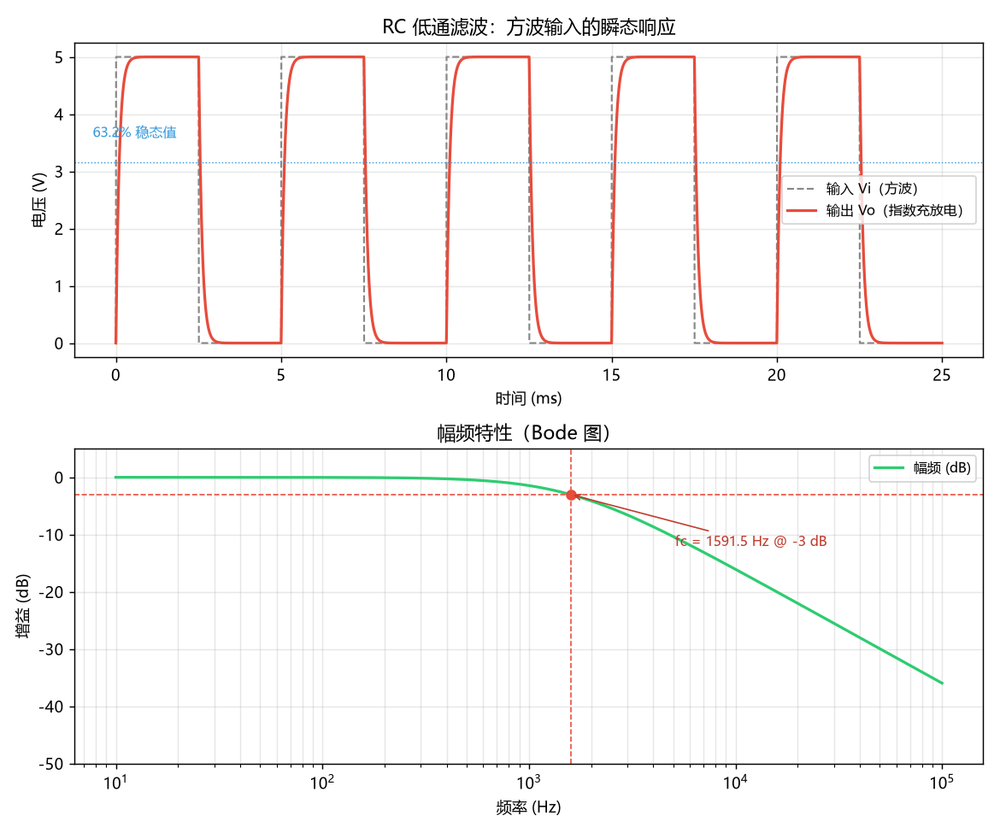
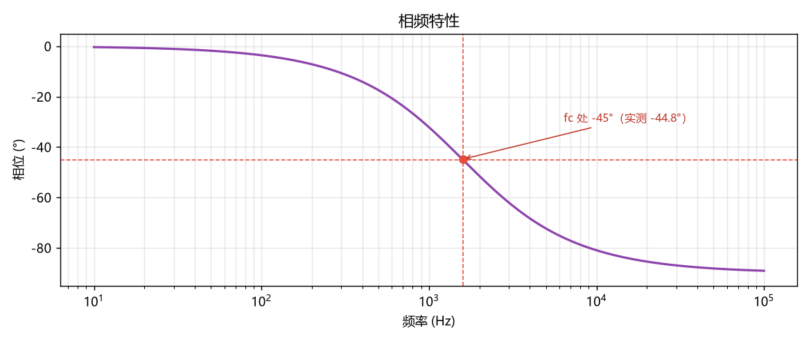
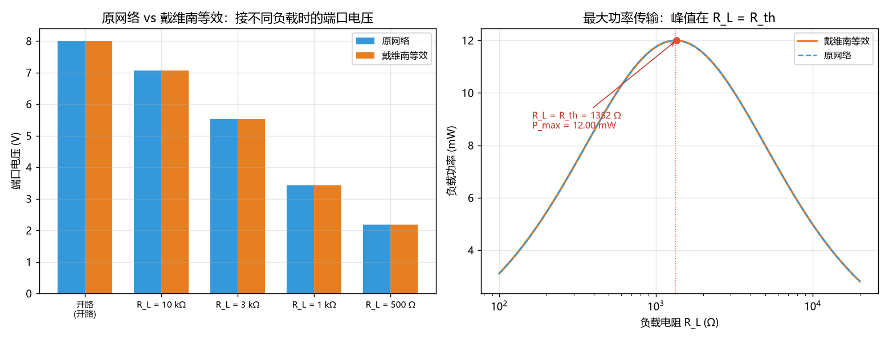
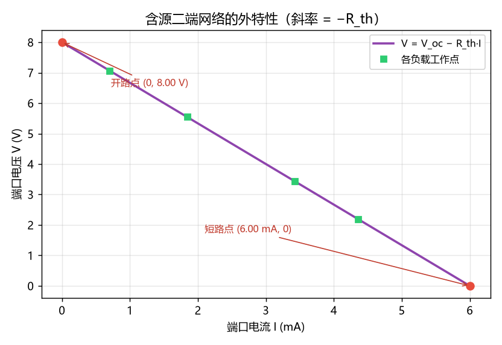
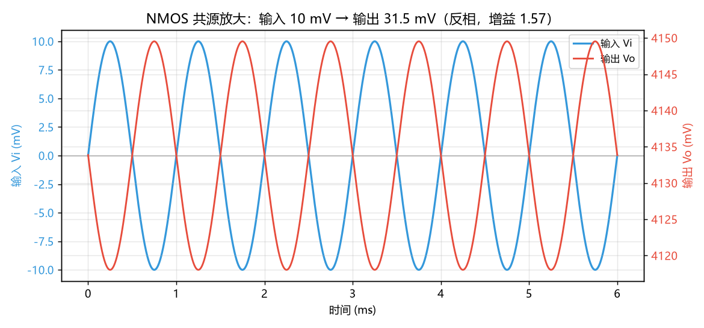
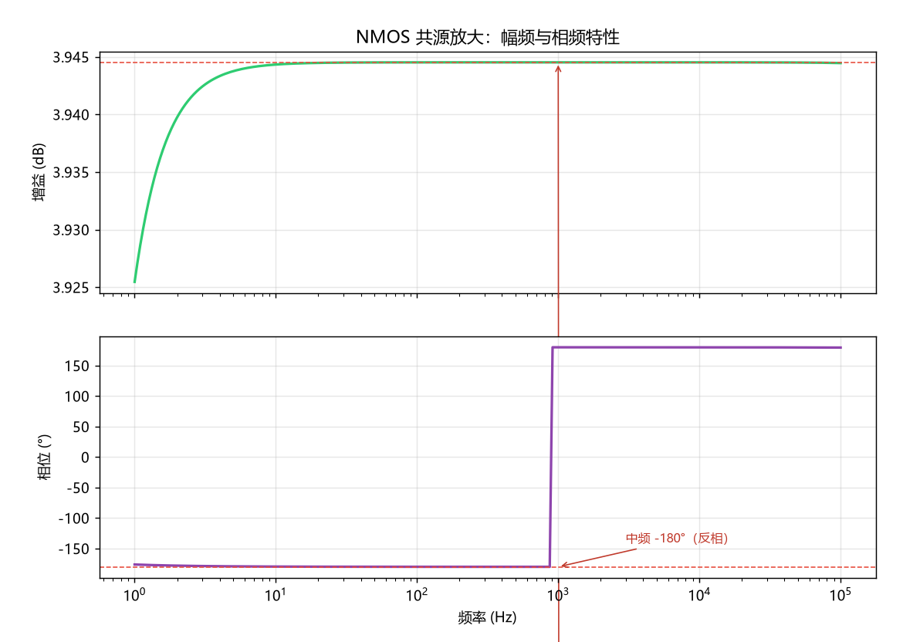

# 进阶挑战（电路）：三个电路的 PySpice 仿真与手算对照

题目要求三个电路都要做、都要交，每个都要有：**自己画的电路图、自己算的理论值、PySpice 仿真数据、以及「理论值 vs 仿真值」对比表**。

本目录就是这一部分的全部代码与出图。

> **注意：本仓库不含电路图**。按"作业电路图自己手绘"的要求，代码里**不生成任何示意图**（原先用 matplotlib 画过一版，已整体删除），全部电路图由我手绘后放进 `output/`。
> 仿真波形图（瞬态、Bode 图、V-I 曲线）属于仿真输出，仍由脚本自动生成。
> 待画的图清单见下面第〇节。

---

## 〇、需要手绘的图（共 4 张）

| 编号 | 画什么 | 建议文件名 | 用在哪一节 |
| --- | --- | --- | --- |
| 图 1 | RC 低通滤波电路（R、C、输入输出端口） | `output/hand_c1_rc_circuit.png` | 三、电路① |
| 图 2 | 含源二端网络（V1 串 R1、V2 串 R2 汇到端口 a，标出端口 a-b） | `output/hand_c2_network.png` | 四、电路② |
| 图 3 | NMOS 共源放大完整电路（VDD、Rg1、Rg2、Rd、Cb1、NMOS） | `output/hand_c3_amplifier.png` | 五、电路③ |
| 图 4 | 两张等效电路：**(a) 直流通路** + **(b) 小信号等效模型** | `output/hand_c3_equivalent.png` | 五、电路③ |

画图时建议标上这些量（都是后面对比表里用到的）：

- **图 1**：R = 1 kΩ、C = 100 nF、标出 Vi / Vo
- **图 2**：V1 = 12 V、R1 = 4 kΩ、V2 = 6 V、R2 = 2 kΩ，端口 a-b（b 为地）
- **图 3**：VDD = 5 V、Rg1 = 60 kΩ、Rg2 = 40 kΩ、Rd = 2 kΩ、Cb1 足够大，以及 NMOS 的 K / V_th / λ
- **图 4**：(a) 里 Cb1 开路、栅极靠 Rg1/Rg2 分压；(b) 里要有 `gm·vgs` 受控源、`ro`、`Rd`，并体现 **ro 与 Rd 是并联**的

> 文件名随意，告诉我实际名字，我就把下面正文里的「图位」替换成对应图片引用。
> 想自己改也很简单：把某处「图位」那段说明换成 `` 即可。

---

## 一、环境与运行

环境已经可用，无需额外安装：

| 组件 | 版本 / 位置 |
| --- | --- |
| Python | 3.13.14（`C:\Users\HP\AppData\Local\Programs\Python\Python313\python.exe`） |
| PySpice | 1.5 |
| Ngspice | 随 PySpice 一起打包的 `ngspice-34.dll` |
| numpy / scipy / matplotlib | 2.5.3 / 1.18.1 / 3.11.1 |

一键跑完三个电路：

```bash
cd circuits
python run_all.py
```

也可以单独跑某个电路，例如 `python circuit3_mosfet_cs.py`。

**关于中文显示**：`plot_setup.py` 会自动挑选系统中文字体（本机命中 `Microsoft YaHei`），并强制使用 `Agg` 后端（这台机器没有图形界面，不设的话会卡住）。脚本会在开头打印一行 `中文字体: xxx`，方便确认图上中文没变成方框。

> **在 Windows 上跑的一个注意点**：如果控制台出现中文乱码，先设 `PYTHONIOENCODING=utf-8`。这是控制台编码问题，不是脚本问题。

---

## 二、文件结构

```
circuits/
├── README.md                     # 本文件（三个电路的说明与对比表）
├── run_all.py                    # 一键跑完三个电路
├── plot_setup.py                 # 出图统一配置（中文字体 / Agg 后端 / 风格）
├── circuit1_rc_lowpass.py        # 电路① RC 低通滤波
├── circuit2_thevenin.py          # 电路② 验证戴维南定理
├── circuit3_mosfet_cs.py         # 电路③ NMOS 共源级放大
└── output/                       # 出图
    ├── c1_rc_transient_bode.png  #   [仿真] 方波瞬态 + 幅频特性
    ├── c1_rc_phase.png           #   [仿真] 相频特性
    ├── c2_thevenin.png           #   [仿真] 原网络 vs 等效电路 + 最大功率传输
    ├── c2_thevenin_vi.png        #   [仿真] 端口 V-I 外特性
    ├── c3_transient.png          #   [仿真] 输入/输出波形（反相放大）
    ├── c3_bode.png               #   [仿真] 幅频与相频
    └── hand_*.png                #   [手绘] 电路图，见第〇节 ← 待放入
```

**代码里不含任何"画电路示意图"的逻辑**——那部分（约 211 行）已按要求删除，只保留仿真计算与数据出图。

---

## 三、电路① RC 低通滤波电路

### 电路图

> **〔图位 1〕手绘：RC 低通滤波电路**
> 待放入 `output/hand_c1_rc_circuit.png`，应包含 R = 1 kΩ、C = 100 nF，并标出 Vi / Vo 端口。
>
> 绘制参考：
> ```
>       R = 1 kΩ
> Vi ──[====]──┬── Vo
>              │
>             ===  C = 100 nF
>              │
>             GND
> ```

### 元件取值与理论计算

题目允许自定元件值，取 **R = 1 kΩ、C = 100 nF**（这样 τ = 100 µs、fc ≈ 1.59 kHz，配 1 kHz 输入很合适）。

**时间常数**

```
τ = R·C = 1×10³ Ω × 100×10⁻⁹ F = 1×10⁻⁴ s = 100 µs
```

**截止频率**（输出幅度降到输入的 1/√2 ≈ 0.707，即 −3 dB）

```
fc = 1 / (2πRC) = 1 / (2π × 1×10⁻⁴) ≈ 1591.55 Hz
```

**传递函数与相移**

```
H(jω) = 1 / (1 + jωRC)
|H| = 1 / √(1 + (f/fc)²)
φ = −arctan(f/fc)
   f = fc 时  φ = −45°
   f → 0  时  φ → 0°
   f → ∞  时  φ → −90°
```

### 仿真设置

- **瞬态**：输入 5 V / 200 Hz 方波（半周期 2.5 ms = 25τ，每个半周期都能充到稳态），步长 τ/200，跑 5 个周期。
- **交流**：10 Hz ~ 100 kHz，每十倍频程 200 点。

### 理论值 vs 仿真值

| 量 | 手算 | 仿真 | 偏差 |
| --- | --- | --- | --- |
| 时间常数 τ（0→63.2%） | 100.0 µs | 99.9 µs | −0.12% |
| 时间常数 τ（10%~90% 上升时间反推） | 100.0 µs | 100.1 µs | +0.14% |
| 截止频率 fc（−3 dB） | 1591.55 Hz | 1582.03 Hz | −0.60% |
| fc 处相移 | −45° | −44.83° | 0.17° |
| 10 Hz 处相移 | ≈0° | −0.36° | — |
| 100 kHz 处相移 | ≈−90° | −89.09° | — |

三条都吻合。fc 那 0.6% 的偏差来自交流扫描的点间隔（每十倍频程 200 点）加上我用的对数插值，不是模型误差。

### 仿真出图





---

## 四、电路② 验证戴维南定理

### 电路图（含源二端网络）

> **〔图位 2〕手绘：含源二端网络**
> 待放入 `output/hand_c2_network.png`，应包含 V1 = 12 V 串 R1 = 4 kΩ、V2 = 6 V 串 R2 = 2 kΩ，两路汇到端口，并**明确标出端口 a-b**（b 为地）。
>
> 绘制参考：
> ```
>             ┌──[ R1 = 4 kΩ ]──┐
>             │                 │
>            V1 = 12 V          ├──── a （端口）
>             │                 │
>            GND                │
>                               │
>             ┌──[ R2 = 2 kΩ ]──┘
>             │
>            V2 = 6 V
>             │
>            GND
> ```

端口 a 就是两个支路汇合的节点，端口 b 是地。注意 **R3 并不存在**——我一开始在草稿里写了 R3（端口到地），实际网表里没有它，端口就是开在这个节点上。

### 理论计算

**开路电压 V_oc**：端口悬空，节点 a 的 KCL

```
(V_a − V1)/R1 + (V_a − V2)/R2 = 0
V_a·(1/R1 + 1/R2) = V1/R1 + V2/R2
V_a = (12/4000 + 6/2000) / (1/4000 + 1/2000) = 0.006 / 0.00075 = 8.0 V
```

**短路电流 I_sc**：端口对地短接，V_a = 0

```
I_sc = V1/R1 + V2/R2 = 12/4000 + 6/2000 = 3 mA + 3 mA = 6.0 mA
```

**戴维南等效电阻 R_th**：两个独立电压源置零（短路）后，从端口看进去是 R1 与 R2 并联

```
R_th = R1 ∥ R2 = (4000 × 2000) / (4000 + 2000) = 1333.33 Ω
```

**接上负载 R_L 后的端口电压**

```
V = (V1/R1 + V2/R2) / (1/R1 + 1/R2 + 1/R_L)
```

### 仿真设置

- **开路**：端口不接任何东西，跑直流工作点读节点电压。
- **短路**：端口对地接 1 µΩ 近似短路线，由 KCL 反推短路电流。
- **R_th 第二种算法**：把 V1、V2 都换成 0 V 源（即短路），端口注入 1 A，测得电压数值上就等于 R_th。
- **接负载验证**：原网络与戴维南等效电路各接同一组负载，逐一对比。
- **最大功率传输**：R_L 从 100 Ω 扫到 20 kΩ（对数 60 点）。

### 理论值 vs 仿真值

| 量 | 手算 | 仿真 | 偏差 |
| --- | --- | --- | --- |
| 开路电压 V_oc | 8.0000 V | 8.0000 V | 0.00% |
| 短路电流 I_sc | 6.0000 mA | 6.0000 mA | 0.00% |
| R_th = V_oc / I_sc | 1333.3333 Ω | 1333.3333 Ω | 0.00% |
| R_th（独立源置零法） | 1333.3333 Ω | 1333.3333 Ω | 0.00% |

**等效替换后接负载的验证表**

| 负载 | 原网络 V | 等效电路 V | 原网络 I | 等效电路 I | 偏差 |
| --- | --- | --- | --- | --- | --- |
| 开路 | 8.0000 V | 8.0000 V | 0 A | 0 A | 0.00e+00% |
| 10 kΩ | 7.0588 V | 7.0588 V | 0.7059 mA | 0.7059 mA | 0.00e+00% |
| 3 kΩ | 5.5385 V | 5.5385 V | 1.8462 mA | 1.8462 mA | 0.00e+00% |
| 1 kΩ | 3.4286 V | 3.4286 V | 3.4286 mA | 3.4286 mA | 0.00e+00% |
| 500 Ω | 2.1818 V | 2.1818 V | 4.3636 mA | 4.3636 mA | 0.00e+00% |

**五种负载下电压和电流的偏差全部是 0.00e+00%** —— 戴维南等效在端口上与原网络完全等价，这正是定理要验证的结论。

**最大功率传输**（顺带验证的）

| 量 | 理论 | 仿真 |
| --- | --- | --- |
| 峰值位置 | R_L = R_th = 1333.3 Ω | R_L = 1352.1 Ω（扫描点间隔内） |
| 最大功率 | V_oc²/(4R_th) = 12.0000 mW | 11.9994 mW |

### 仿真出图





外特性是一条直线 `V = V_oc − R_th·I`，斜率就是 −R_th，两端点分别是开路点和短路点。

---

## 五、电路③ NMOS 共源级放大电路

### 电路图

> **〔图位 3〕手绘：NMOS 共源放大完整电路**
> 待放入 `output/hand_c3_amplifier.png`，应包含 VDD = 5 V、Rd = 2 kΩ、Rg1 = 60 kΩ、Rg2 = 40 kΩ、输入耦合电容 Cb1（足够大）、NMOS（标出 K = 0.8 mA/V²、V_th = 1 V、λ = 0.02 /V），源极接地。
>
> 绘制参考：
> ```
>               VDD = 5 V
>                │
>               [Rd] 2 kΩ
>                │
>     Vi ──||────┼────── Vo          Cb1 足够大（交流短路）
>          Cb1   │
>           ┌────┤
>          [Rg1] │ [Rg2]
>           └────┤
>                │
>             ┌──┴──┐
>             │ G   │  NMOS
>             │  S──┴── GND
>             └─────┘
> ```

题目给定了全部参数：VDD = 5 V、Rg1 = 60 kΩ、Rg2 = 40 kΩ、Rd = 2 kΩ、Cb1 足够大、NMOS 的 K = 0.8 mA/V²、V_th = 1 V、λ = 0.02 /V，输入 Vi = 10 mV / 1 kHz 正弦。

因为题目没给 Rs，所以**源极直接接地**，于是 V_GS = V_G。

### 手算静态工作点

**栅极电压**（Rg1、Rg2 分压，栅极不取电流）

```
V_G = VDD × Rg2/(Rg1+Rg2) = 5 × 40/(60+40) = 2.0 V
V_GS = V_G = 2.0 V                     （源极接地）
```

**漏极电流**（先假定工作在饱和区，用平方律）

```
V_OV = V_GS − V_th = 2.0 − 1.0 = 1.0 V
I_D = ½·K·V_OV² = ½ × 0.8 mA/V² × (1.0 V)² = 0.4 mA
```

**漏源电压**

```
V_DS = VDD − I_D·Rd = 5 − 0.4 mA × 2 kΩ = 5 − 0.8 = 4.2 V
```

**饱和区判据**

```
V_DS > V_GS − V_th  →  4.2 V > 1.0 V  ✓
```

确实工作在饱和区，假定成立。

### 手算小信号参数与增益

```
gm = ∂I_D/∂V_GS = K·V_OV = 0.8 mA/V² × 1.0 V = 0.8 mA/V
ro = 1/(λ·I_D) = 1/(0.02 × 0.4 mA) = 125 kΩ
Rd ∥ ro = (2 × 125)/(2 + 125) = 1.9685 kΩ

Av = vo/vi = −gm·(Rd ∥ ro) = −0.8 mA/V × 1.9685 kΩ = −1.5748
```

负号表示**反相**。若忽略 ro 的近似：`Av ≈ −gm·Rd = −1.6`，与精确值差 1.6%。

### 直流通路与小信号等效模型

> **〔图位 4〕手绘：两张等效电路**
> 待放入 `output/hand_c3_equivalent.png`，建议画成左右两张：
> **(a) 直流通路**——Cb1 开路、栅极由 Rg1/Rg2 分压、Rd 接在 VDD 与漏极之间、源极接地；
> **(b) 小信号等效模型**（中频）——输入 vi 直加栅极、`gm·vgs` 受控源、以及 **ro 与 Rd 并联**在输出节点上。

- **(a) 直流通路**：Cb1 开路，所以输入源被隔离，栅极电压只由 Rg1/Rg2 分压决定；Rd 接在 VDD 与漏极之间。
- **(b) 小信号等效模型**（中频，电容短路）：输入 vi 直接加在栅极（因为 Cb1 短路，且 Rg1∥Rg2 只分走输入电流、不改变栅极电压）；受控源 `gm·vgs` 从漏极流向地；`ro` 与 `Rd` 都从漏极接到地，因此是并联关系。

### 理论值 vs 仿真值

**静态工作点**

| 量 | 手算 | 仿真 | 偏差 |
| --- | --- | --- | --- |
| V_GS | 2.0000 V | 2.0000 V | 0.0000% |
| I_D | 0.4000 mA | 0.4000 mA | 0.0000% |
| V_DS | 4.2000 V | 4.2000 V | 0.0000% |

**增益**

| 量 | 手算 | 仿真 | 说明 |
| --- | --- | --- | --- |
| 瞬态实测增益（带符号） | −1.5748 | −1.5748 | 输入 20 mVpp → 输出 31.4957 mVpp |
| 中频增益（交流扫描） | −1.5748（3.94 dB） | −1.5748（3.94 dB） | 并上代表 ro 的电阻后 |
| 相位 | 反相（180°） | 反相 ✓ | 相关和判据 |

### 仿真出图





---

## 六、这一部分踩到的坑（都是真实的调试过程）

写这三个电路时踩的坑比做游戏时还密集，挑几个有代表性的记下来。

### 1. 把 K 和 SPICE 的 KP 搞混，I_D 差了一倍

题目给的 `K = 0.8 mA/V²` 是 `I_D = ½·K·V_OV²` 里的系数。而 SPICE level-1 模型的公式也是 `I_D = ½·KP·(Vgs−Vth)²`，所以 **KP 直接等于题目的 K**，不该再乘 2。

我一开始既按 `½K·V_ov²` 手算、又给 KP 乘了 2，结果仿真 I_D = 0.8 mA 而手算 0.4 mA，差整一倍。**是对比表当场把这个错抓出来的**——如果只是"跑个仿真看看波形"，这个 2 倍误差很可能就混过去了。

后来我用**直流扫描 + 数值微分**独立验证了一次：`gm(数值) = K·V_OV = 0.8 mA/V`，与手算完全一致，确认公式没写错。

### 2. `100 @ u_F` 生成的是 100 法拉，不是 100 微法

网表里出现了这一行：

```
Cb1 1 2 100
```

也就是耦合电容成了 **100 F**——近似短路。后果是栅极被输入源强行钳住，交流增益退化成恰好等于 gm（1.6），而理论值是 −1.55。波形看着"像在放大"，但数值系统性偏大。

改成直接写 SI 数值 `100e-6` 后一切正常。**教训：跨单位库传参时，把生成的网表打出来看一眼**，比相信包装层可靠。

### 3. cgs / cgd 不是合法的 ngspice 模型参数

我本想通过模型参数设置 MOS 的寄生电容，结果报 `no such parameter on this device`。于是逐个参数试，定位到 `level`/`vto`/`kp`/`lambd` 都合法，只有 `cgs`/`cgd` 不行。

改成在电路里接两只实体电容（Cgs 栅-源、Cgd 栅-漏）。这样反而更好：等效模型本来就要画它们，现在图上有实物。

### 4. ngspice 的 level-1 模型在 AC 分析里不计 λ

这个最隐蔽。我从 AC 扫描得到的增益总是 `−gm·Rd`，而不是 `−gm·(Rd∥ro)`。为了确认，我把 λ 从 0 扫到 0.5（跨度很大），**AC 增益一点没变**，始终是 −1.6。

结论：该模型在交流小信号分析里把输出电导 gds 算成 0（ro → ∞），λ 只在别处生效（本例的直流偏置与 λ 无关，所以看不出来）。

**处理方式**：不掩盖，也不硬说"仿真和手算一致"。我在漏极与地之间**并了一只数值等于 1/(λ·I_D) = 125 kΩ 的显式电阻**来代表 ro，这样 `Av = −gm·(Rd∥ro) = −1.5748` 才被真正验证到。脚本里同时打印了两种结果（−1.5748 与 −1.6000），并写明差异来源。

### 5. 相位判据写错了

我一开始用 `gain < 0` 判断输出是否反相——但 `gain` 是两个**峰峰值**之比，恒为正，这个判据永远为假，于是打印"同相 ✗"。改成用去直流后的**相关和**判断（负值即反相），才正确显示 180°。

### 6. 用代码画电路示意图是个错误的方向

我一开始用 matplotlib 硬画直流通路与小信号等效电路（`_wire` / `_resistor` / `_ground` 拼坐标，约 210 行），返工了两次：第一版 `V_G` 标注和 NMOS 方块重叠、`ro` 与 `Rd` 的标注叠在一起；加了"标注放左侧还是右侧"的参数后仍有轻微重叠。

最后按"作业电路图自己手绘"的要求把这部分**整体删掉**了。回头看不该走这条路：**用绘图代码去模拟人手画示意图，投入产出比极低**——真正的电路图工具（或直接手绘拍照）几分钟就能画得比它清楚。**教训：先判断这件事该不该用代码做，再决定怎么写代码。**

---

## 七、小结

三个电路的核心结论都成立，而且都是**用数值对比验证过**的，不是"跑出个波形就算完"：

| 电路 | 核心结论 | 手算 vs 仿真 |
| --- | --- | --- |
| ① RC 低通 | τ = RC、fc = 1/(2πRC)、fc 处相移 −45° | 偏差 < 0.6% |
| ② 戴维南 | V_oc = 8 V、I_sc = 6 mA、R_th = 1333.33 Ω，等效后端口特性完全一致 | 五种负载下偏差全为 0 |
| ③ NMOS 共源 | V_GS = 2 V、I_D = 0.4 mA、V_DS = 4.2 V（饱和），Av = −1.5748 | 静态工作点偏差 0.0000%，增益完全一致 |
